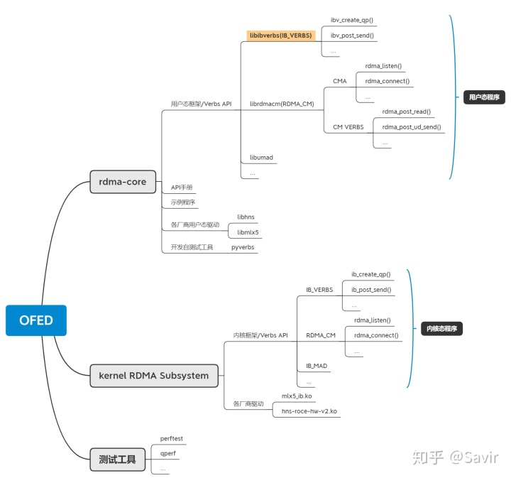

### Verbs API

Verbs API是一组用于使用RDMA服务的最基本的软件接口，也就是说业界的RDMA应用，要么直接基于这组API编写，要么基于在Verbs API上又封装了一层接口的各种中间件编写。

Verbs API向用户提供了有关RDMA的一切功能，典型的包括：注册MR、创建QP、Post Send、Poll CQ等等。

对于Linux系统来说，Verbs的功能由rdma-core和内核中的RDMA子系统提供，分为用户态Verbs接口和内核态Verbs接口，分别用于用户态和内核态的RDMA应用。




### IB_VERBS

接口以ibv_xx（用户态）或者ib_xx（内核态）作为前缀，是最基础的编程接口，使用IB_VERBS就足够编写RDMA应用了。

比如：

- ibv_create_qp() 用于创建QP
- ibv_post_send() 用于下发Send WR
- ibv_poll_cq() 用于从CQ中轮询CQE

### RDMA_CM

以rdma_为前缀，主要分为两个功能：

#### CMA（Connection Management Abstraction）--建链管理

在Verbs API基础上实现的，用于CM建链并交换信息的一组接口。CM建链借鉴了Socket的流程和API，底层是基于QP实现的，从用户的角度来看，是在通过QP交换之后数据交换所需要的QPN，Key等信息。

比如：

- rdma_listen()用于监听链路上的CM建链请求。
- rdma_connect()用于确认CM连接。

#### CM VERBS       --收发数据

RDMA_CM也可以用于收发数据，相当于在verbs API上又封装了一套数据交换接口。

比如：

- rdma_post_read()可以直接下发RDMA READ操作的WR，而不像ibv_post_send()，需要在参数中指定操作类型为READ。
- rdma_post_ud_send()可以直接传入远端QPN，指向远端的AH，本地缓冲区指针等信息触发一次UD SEND操作。

上述接口虽然方便，但是需要配合CMA管理的链路使用，不能配合Verbs API使用。

Verbs API除了IB_VERBS和RDMA_CM之外，还有MAD（Management Datagram）接口等。

### Verbs API所包含的内容

#### 控制面：

##### 设备管理：

```
device_list ibv_get_device_list()
```

用户获取可用的RDMA设备列表，会返回一组可用设备指针

```
device_context ibv_open_device(device)
```

打开一个可用的RDMA设备，返回其上下文指针（这个指针会在以后用来对这个设备进行各种操作）。

```
device_attr, ibv_query_device(device_context*)
```

查询一个设备的属性/能力，比如其支持的最大QP，CQ数量等。返回设备的属性结构体指针，以及错误码

##### 资源的创建，查询，修改和销毁

```
ibv_alloc_pd(device_context)
```

申请PD，该函数会返回一个PD的指针。

注：在RDMA（Remote Direct Memory Access）中，保护域（Protection Domain，通常简称为PD）是一个用于限制RDMA操作范围的概念。PD定义了一组内存区域，这些区域可以用于RDMA操作。PD内存并不是指实际存储数据的内存，而是一组描述RDMA操作权限和规则的数据结构。

当你使用RDMA进行数据传输时，你需要在PD内注册内存区域，使其能够被RDMA适配器访问。注册内存区域时，你需要提供该内存区域的虚拟地址、大小和访问权限。RDMA适配器会将这个内存区域映射到自己的地址空间中，使得远程节点可以通过RDMA操作来访问这个区域。在这个过程中，PD中存储了注册的内存区域的信息。

在RDMA的实际使用中，你可以在一个PD内注册多个内存区域，每个区域可以用于不同的RDMA操作。通过使用PD，你可以更加精细地控制和管理RDMA操作的权限和范围。


```
ibv_reg_mr(pd,addr,length,access_flag)
```

注册MR，用户传入要注册的内存的起始地址和长度，以及这个MR将要从属的PD和它的访问权限（本地读/写，远端读/写等），返回一个MR的指针给用户


```
ibv_create_cq(device_context,cqe_depth, ...)
```

创建CQ，用户传入CQ的最小深度（驱动实际申请的可能比这个值大），然后该函数返回CQ的指针。


```
ibv_create_qp(pd,qpinit_attr)
```

创建QP，用户传入PD和一组属性（包括RQ和SQ绑定到的CQ，QP绑定的SRQ，QP的能力，QP类型等），向用户返回QP的指针。


```
ibv_modiy_qp(qp,attr,attr_mask)
```

修改QP，用户传入QP指针，以及表示要修改的属性的掩码和修改值。修改的内容可以是QP状态，对端QPN（QP的序号），QP能力，端口号和重传次数等，如果失败，该函数会返回错误码。Modify QP最重要的作用是让QP在不同的状态间迁移，完成RST-->INIT-->RTR-->RTS的状态机转移后才具备下发Send WR的能力，也可以来将QP切换到ERROP状态。

注：

1. **RESET（重置）**：QP初始状态或在出错时返回的状态。在RESET状态下，QP不能发送或接受数据。

2. **INIT（初始化）**：在INIT状态下，QP可以接受另一个QP的请求，但是还不能开始数据传输。在RDMA中，INIT状态用于双方进行初始化配置。

3. **RTR（Ready to Receive）**：在RTR状态下，QP已经准备好接收数据。在RDMA中，RTR状态通常发生在双方完成了初始化配置并准备好数据传输时。

4. **RTS（Ready to Send）**：在RTS状态下，QP可以开始发送数据。QP在RTS状态下可以处理Send和Receive操作。

5. **ERROR（错误）**：QP在发生错误时会被切换到ERROR状态，此时QP无法发送或接受数据。ERROR状态通常意味着RDMA操作失败，需要进行错误处理和恢复。

6. 状态机转移的过程如下：

   - **RESET -> INIT -> RTR -> RTS**：在初始化配置完成后，双方的QP将从RESET状态转移到RTS状态，此时可以进行RDMA操作。

   - **任意状态 -> ERROR**：在发生错误时，QP可以从任意状态转移到ERROR状态，表示QP处于错误状态。在ERROR状态下，QP不能继续进行数据传输。

     

```
ibv_destory_qp(qo)
```

销毁QP，即销毁QP相关的软件资源。


##### 中断处理

```
ibv_get_async_event(device_context)
```

从事件队列中获取一个异步事件，返回异步事件的信息（事件来源，事件类型等）以及错误码。


##### 连接管理

```
rdma_xxx()
```

用于CM建链


#### 数据面

##### 下发WR

```
ibv_post_send(qp,wr)
```

向一个QP下发一个Send WR，参数wr是一个结构体，包含WR所有信息。

WR的结构会根据服务类型和操作类型有所差异，WR经由驱动进一步处理后，会转化为WQE下发给硬件，出错之后，该接口会返回出错的WR的指针以及错误码。


```
ibv_post_recv(qp,wr)
```

同ibv_post_send。


##### 获取WC

```
ibv_poll_cq(cq,max_num)
```

WC(Work Completion)是指示RDMA操作完成的数据结构。当RDMA适配器完成了一个工作请求时，它会生成一个WC数据结构，用于通知应用程序操作的完成状态和相关信息。

从完成队列CQ中轮询CQE，用户需要提前准备好内存来存放WC，并传入可以接收多少个WC，该接口会返回一组WC结构体以及WC的数量。


### 代码详解

```
#define TEST_NZ(x) do { if ( (x)) die("error: " #x " failed (returned non-zero)." ); } while (0)
#define TEST_Z(x)  do { if (!(x)) die("error: " #x " failed (returned zero/null)."); } while (0)

```

这是两个宏定义，用于简化错误检查的代码。它们通常用于在程序中进行函数调用后的错误处理。这两个宏定义的主要目的是在函数调用后检查函数的返回值，并根据返回值是否为非零或空（NULL）来触发错误处理。

1. `TEST_NZ(x) do { if ( (x)) die("error: " #x " failed (returned non-zero)."); } while (0)`

   - 这个宏接受一个表达式 `x` 作为参数，并在 `x` 的值为非零时触发错误处理。如果 `x` 的值为非零，它会调用 `die` 函数，并输出错误信息，指示哪个表达式返回了非零值。
   - `#x` 是一个预处理器（preprocessor）操作符，它将 `x` 转换为一个字符串字面量。这样，在错误信息中就可以显示出具体的表达式。
   - `do { ... } while (0)` 是一个常用的技巧，它使得这个宏可以像函数一样使用，同时又避免了在宏展开时引入不必要的分号问题。

2. `TEST_Z(x) do { if (!(x)) die("error: " #x " failed (returned zero/null)."); } while (0)`

   - 这个宏也接受一个表达式 `x` 作为参数，并在 `x` 的值为零（或NULL）时触发错误处理。如果 `x` 的值为零（或NULL），它会调用 `die` 函数，并输出错误信息，指示哪个表达式返回了零值或空指针。

     

```
const int BUFFER_SIZE = 1024;
const int TIMEOUT_IN_MS = 500; /* ms */
```

const表示常量不可修改


```
struct context {
  struct ibv_context *ctx;
  struct ibv_pd *pd;
  struct ibv_cq *cq;
  struct ibv_comp_channel *comp_channel;
 
  pthread_t cq_poller_thread;
};
```

`struct ibv_context` 包含了 RDMA 设备的上下文信息。

`struct ibv_comp_channel` 是用于异步事件通知的通道。RDMA 完成事件可以通过这个通道异步通知应用程序，避免了轮询 Completion Queue 的需求，提高了程序的效率。

`cq_poller_thread` 是一个线程标识符，通常用于存储异步事件处理线程的信息。在这个结构体中，它用于存储处理 Completion Queue 异步事件的线程的标识符。

`pthread_t` 是 POSIX 线程库（Pthreads）中定义的数据类型，用于表示线程标识符（Thread ID）。在多线程编程中，`pthread_t` 通常用于声明和存储线程的唯一标识符。每个线程都有一个唯一的 `pthread_t` 标识符。

```
struct connection {
  struct rdma_cm_id *id;
  struct ibv_qp *qp;
 
  struct ibv_mr *recv_mr;
  struct ibv_mr *send_mr;
 
  char *recv_region;
  char *send_region;
 
  int num_completions;
};
```

这段代码定义了一个名为 `connection` 的结构体，该结构体用于存储与 RDMA 连接相关的信息

`num_completions` 是一个整数，用于记录已完成的 RDMA 操作的数量。在 `on_completion` 函数中，当完成的 RDMA 操作数达到一定数量时，会触发断开连接的动作。


```
int main(int argc, char **argv)
{
  struct addrinfo *addr;
  struct rdma_cm_event *event = NULL;
  struct rdma_cm_id *conn= NULL;
  struct rdma_event_channel *ec = NULL;
```

d`int main(int argc, char **argv)`: 这是程序的主函数，它是程序的入口点。它接受命令行参数 `argc` 和 `argv`，`argc` 表示参数个数，`argv` 是一个指向参数字符串数组的指针。

`struct addrinfo *addr`：是一个指向`struct addrinfo`结构体的指针，通常用于存储地址信息。

`struct rdma_cm_event *event = NULL`:用于存储RDMA事件

`struct rdma_cm_id *conn = NULL`：用于存储RDMA连接标识符

`struct rdma_event_channel *ec = NULL` ：用于存储RDMA事件通道


```

if (argc != 3)
    die("usage: client <server-address> <server-port>");
  TEST_NZ(getaddrinfo(argv[1], argv[2], NULL, &addr));
```

1. **`if (argc != 3)`**：这行代码检查命令行参数的数量是否不等于3。
2. **`die("usage: client <server-address> <server-port>");`**：如果参数数量不等于3，就调用`die`函数，并显示一个用法消息。这个函数可能会打印一个错误消息，并退出程序。
3. **`TEST_NZ(getaddrinfo(argv[1], argv[2], NULL, &addr));`**：如果参数数量等于3，就使用`getaddrinfo`函数获取指定服务器地址和端口的地址信息。


```(
int getaddrinfo(const char *node,const char *service,const struct addrinfo *hints,struct addrinfo **res)
```

'**node'**参数是一个主机名或ip地址字符串，用于指定目标主机地址

**'service'**参数是目标服务的端口号

**'hints'**是一个**'struct addrinfo'**结构体指针，用于提供关于返回地址信息的一些提示，如果不需要可以设置为'NULL'

**'res'**是一个指向**'struct addrinfo'**结构体链表的指针，用于存储获取到的地址信息


```
TEST_NZ(rdma_create_id(ec, &conn, NULL, RDMA_PS_TCP));
```

**'rdma_create_id'**是RDMA API 中的一个函数，用于创建RDMA连接

**'ec'是一个已经创建的 RDMA 事件通道句柄，它是通过调用 `rdma_create_event_channel()` 函数创建的。**

**&conn**是一个指向 **rdma_cm_id** 结构体指针的指针，**rdma_cm_id** 结构体是用于表示 RDMA 连接的数据结构。这个指针将在函数调用完成后，指向新创建的 RDMA 连接句柄。

**'NULL'**参数表示不指定本地地址（Local Address）和路由信息（Routing Information）。

**'RDMA_PS_TCP'** 表示使用 TCP/IP 协议套接字进行 RDMA 连接。


```
int rdma_create_id(struct rdma_event_channel *channel,struct rdma_cm_id **id,void *context, enum rdma_port_space ps)
```

**'channel'**是一个指向**'rdma_event_channel'**结构体的指针，代表一个RDMA事件通道

**'id'**是一个指向**'rdma_cm_id'**结构体指针的指针，在函数调用成功后，**'id'**将指向新创建的RDMA连接句柄

**'context'**是一个用户定义的上下文指针，用于关联到新创建的RDMA连接句柄。

**'ps'**是一个枚举类型，用于指定RDMA连接所使用的端口间通常，RDMA 连接使用 TCP/IP 协议套接字，所以 `ps` 的值可以设置为 `RDMA_PS_TCP`。


```
TEST_NZ(rdma_resolve_addr(conn, NULL, addr->ai_addr, TIMEOUT_IN_MS));
```

```
int rdma_resolve_addr(struct rdma_cm_id *id, struct sockaddr *src_addr, struct sockaddr *dst_addr, int timeout_ms);
```

**'src_addr'** 是本地地址的指针，通常可以设置为 `NULL`，表示由系统自动选择本地地址

**'dst_addr'**是目标地址的指针，通常应该设置为 `addr->ai_addr`，其中 `addr` 是之前通过 `getaddrinfo` 函数获取到的目标地址信息。

**'timeout_ms'**是解析地址的超时时间，以毫秒为单位。

**'rdma_resolve_addr'**函数的作用是尝试将 `id` 与指定的 `dst_addr` 关联起来，以便建立 RDMA 连接。如果解析成功，`id` 将会关联到指定的目标地址，可以通过后续的 RDMA 操作进行数据传输。


```
freeaddrinfo(addr)
```

释放该链表占用的内存空间


```
  while (rdma_get_cm_event(ec, &event) == 0) {
    struct rdma_cm_event event_copy;
 
    memcpy(&event_copy, event, sizeof(*event));
    rdma_ack_cm_event(event);
 
    if (on_event(&event_copy))
      break;
  }
```

**'rdma_get_cm_event(ec, &event) == 0'**:这个条件语句检查是否有新的RDMA事件。**'rdma_get_cm_event'**试图从RDMA通信管理器中获取一个事件，并且将事件的指针存储在**'event'**变量中。

**'struct rdma_cm_event event_copy'**:在进入事件处理循环之前，声明一个**'event_copy'**变量，用于保存事件的副本。

**'memcpy(&event_copy, event, sizeof(*event))'**:通过**memcpy**函数将获取到的事件内容复制到**'event_copy'**,为了防止在后续的事件处理中，原始事件被修改。**'&event_copy'**指定了目标内存区域的起始地址，即新创建的'**event_copy'**变量的地址，**'event'**：指定了源内存区域的起始地址，即原始事件的地址。**'sizeof(*event)'**:计算了**'rdma_cm_event'**结构体的大小


```
rdma_ack_cm_event(event)
```


确认并且释放相关资源

```
void die(const char *reason);
```

**'void'**表示函数没有返回值

**'const char *reason'**       **const**表示参数类型是只读


```
fprintf(stderr, "%s\n", reason);
exit(EXIT_FAILURE)
```

**`fprintf(stderr, "%s\n", reason);`**：

- `fprintf` 是一个C标准库函数，用于将格式化的输出写入到指定的文件流中。第一个参数是文件流，`stderr` 表示标准错误输出，通常与终端相关联。
- `" %s\n"` 是格式字符串，其中 `%s` 是一个占位符，表示要输出一个字符串。`\n` 表示换行符，用于在输出中换行。
- `reason` 是一个字符串参数，它是`die`函数的输入参数，包含了错误信息。这个字符串会被格式化并输出到标准错误流。

这一行代码的作用是将`reason`字符串的内容输出到标准错误流，并在末尾添加一个换行符。

**`exit(EXIT_FAILURE);`**：

- `exit` 是一个C标准库函数，用于终止程序的执行。它接受一个整数参数，通常被用来表示程序的退出状态。`EXIT_FAILURE` 是一个在 `stdlib.h` 头文件中定义的宏，表示程序非正常退出的状态码。
- 当程序调用 `exit(EXIT_FAILURE);` 时，它会立即终止程序的执行，并返回给操作系统，同时传递了一个退出状态码，告诉操作系统程序以失败的状态退出。


```
s_ctx = (struct context *)malloc(sizeof(struct context));
```

**malloc**用于动态分配内存，**malloc**接受一个参数，表示要分配的内存块的字节数，返回一个指向新分配内存起始地址的指针
