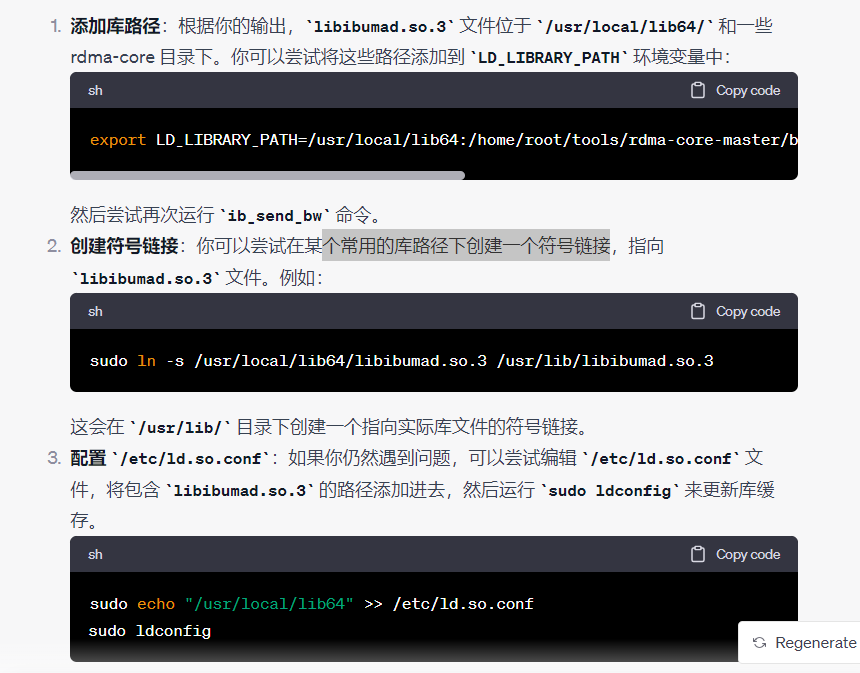

### RDMA

**创建符号链接**

```
ln -s /usr/local/lib64/libibumad.so.3 /usr/lib/libibumad.so.3
```




把 `/usr/local/lib64` 添加到共享库搜索路径中。

```
export LD_LIBRARY_PATH=/usr/local/lib64:$LD_LIBRARY_PATH
```

### 天脉

查看磁盘 `/dev/sda` 的分区信息

```
sudo fdisk -l /dev/sda

```

查看根目录分区的使用情况

```
df -h /dev/sda3

```

### softroce

configure: error: cannot guess build type; you must specify one

```
./configure --build=aarch64-unknown-linux-gnu

```

确认当前内核是否支持RXE

```
cat /boot/config-$(uname -r) | grep RXE
```

加载内核驱动

```
modprobe rdma_rxe
```

用户态配置

```
sudo rdma link add rxe_0 type rxe netdev ens33
```

用rdma工具查看是否添加成功：

```
rdma link
```

查看当前控制台的打印级别

```
cat /proc/sys/kernel/printk
```

该文件有4个数字值，它们根据日志记录消息的重要性，定义将其发送到何处，上面显示的4个数据分别对应如下：

控制台日志级别：优先级高于该值得消息将被打印到到控制台；

默认的消息日志级别：将用该优先级来打印没有优先级的消息；

最低的控制台日志级别：控制台日志级别可被设置的最小值（最高优先级）；

默认的控制台日志级别：控制台日志级别的缺省值。

**内核消息打印级别：** 内核消息可以按照不同的级别进行打印。级别的含义如下：

- 0：KERN_EMERG（紧急） - 最高优先级的消息。
- 1：KERN_ALERT（警告） - 警告级别消息。
- 2：KERN_CRIT（关键） - 关键级别消息。
- 3：KERN_ERR（错误） - 错误级别消息。
- 4：KERN_WARNING（警告） - 警告级别消息。
- 5：KERN_NOTICE（通知） - 通知级别消息。
- 6：KERN_INFO（信息） - 信息级别消息。
- 7：KERN_DEBUG（调试） - 调试级别消息。


```
interrupt_number=$(echo "$interrupt_line" | awk '{print $1}' | sed 's/://')
```

1. `echo "$interrupt_line"`：这部分会将包含中断信息的 `interrupt_line` 变量的内容输出到标准输出。
2. `awk '{print $1}'`：使用 `awk` 命令，它会将输入的文本分割成字段（默认使用空格分隔），并输出第一个字段。`'{print $1}'` 表示输出第一个字段，通常是中断号。
3. `sed 's/://'`：使用 `sed` 命令，它用于查找冒号 (`:`) 并将其替换为空字符，从而去除中断号中的冒号。这个操作可以将中断号从形如 "9:" 的格式中提取为纯数字格式。
