### linux网络收包

#### linux收包总览


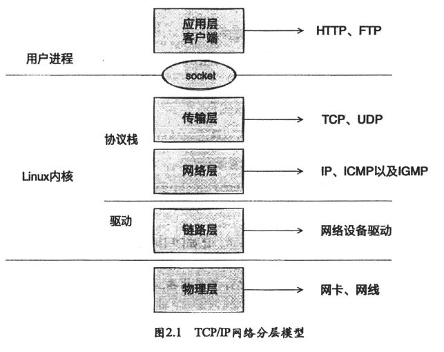

linux中断处理函数分为上半部和下半部，下半部分实现方式是软中断，由ksoftirqd内核线程全权处理，硬中断通过给CPU物理引脚施加电压变化实现。

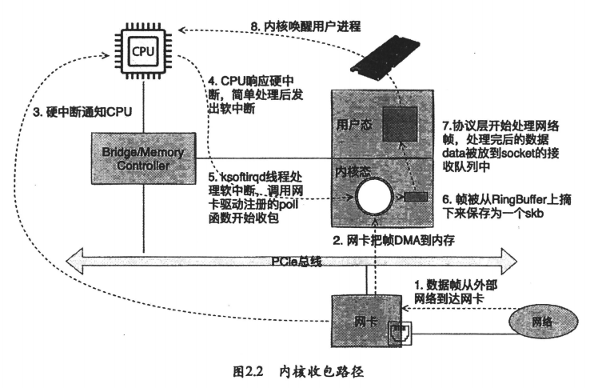

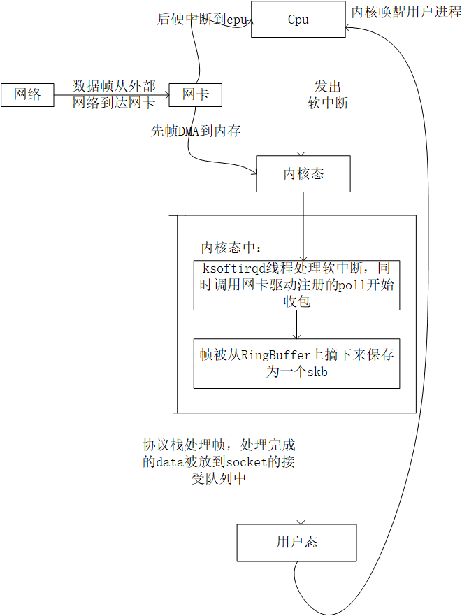

网卡收到数据，以DMA的方式将网卡收到的帧写到内存里。再向CPU发起中断，通知CPU有数据到达。当CPU收到中断请求后，会去调用网络设备驱动注册的中断处理函数，然后尽快释放CPU资源，ksoftirqd内核线程检测到有软中断请求到达，调用poll开始轮询收包，收到后交由各级协议栈处理。

DMA（直接内存访问）是计算机系统中的一种数据传输技术，它允许外部设备（如硬盘驱动器、网络适配器、显卡等）直接访问计算机内存，而无需通过中央处理单元（CPU）的直接干预。DMA的主要目标是提高数据传输的效率和性能，减少CPU的负载，因为CPU不必处理每个数据传输操作。

#### linux启动

在收包之前需要提前创建好ksoftirqd内核线程，注册好各个协议对应的处理函数，网卡设备子系统要提前初始化好，网卡要启动好

##### 创建ksoftirqd内核线程

内核线程（ksoftirqd）的线程数量是你机器的核数，系统初始化在kernel/smpboot.c中调用了smpboot_register_percpu_thread函数进一步执行到spawn_ksoftirqd（位于kernel/softirq.c）创建出softirqd线程

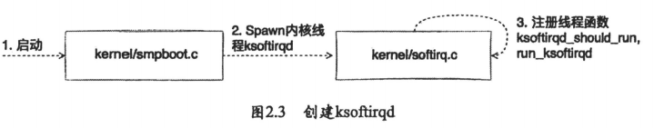

```
static struct smp_hotplug_thread softirq_threads = {
	.store			= &ksoftirqd,
	.thread_should_run	= ksoftirqd_should_run,
	.thread_fn		= run_ksoftirqd,
	.thread_comm		= "ksoftirqd/%u",
};
```

定义了一个静态结构体 `softirq_threads`，用于描述与软中断相关的线程的一些属性和操作。这个结构体在多处理器系统中用于管理和控制软中断处理的线程。

1. `.store = &ksoftirqd,`

   这一行代码给 `softirq_threads` 结构体的 `.store` 成员赋值，将 `&ksoftirqd` 的地址赋给了它。`ksoftirqd` 通常是一个与软中断（softirq）相关的数据结构或者线程。
2. `.thread_should_run = ksoftirqd_should_run,`

   这一行代码给 `softirq_threads` 结构体的 `.thread_should_run` 成员赋值，通常这个成员会指向一个函数，它用于确定是否应该运行 `ksoftirqd` 线程。

3. `.thread_fn = run_ksoftirqd,`

   这一行代码给 `softirq_threads` 结构体的 `.thread_fn` 成员赋值，通常这个成员会指向一个函数，它是 `ksoftirqd` 线程实际执行的函数。

4. `.thread_comm = "ksoftirqd/%u",`

   这一行代码给 `softirq_threads` 结构体的 `.thread_comm` 成员赋值，通常这个成员会包含线程的名称，这里的 `%u` 是一个占位符，用于在运行时插入一个无符号整数值，以便创建一个唯一的线程名称。

```
static __init int spawn_ksoftirqd(void)
{
	cpuhp_setup_state_nocalls(CPUHP_SOFTIRQ_DEAD, "softirq:dead", NULL,
				  takeover_tasklets);
	BUG_ON(smpboot_register_percpu_thread(&softirq_threads));

	return 0;
}
early_initcall(spawn_ksoftirqd);
```

这段代码的作用是在内核初始化的早期阶段设置与软中断相关的初始化状态并尝试启动相应的线程。如果线程注册失败，它将导致内核崩溃，以提醒开发人员存在严重问题。这些线程通常用于处理内核中的软中断任务。

1. `cpuhp_setup_state_nocalls` 函数调用：
   - `cpuhp_setup_state_nocalls` 是一个函数，用于设置 CPU 热插拔（CPU Hotplug）状态。在这里，它设置了一个名为 `CPUHP_SOFTIRQ_DEAD` 的状态，并关联了一个描述为 "softirq:dead" 的字符串。
   - 这个函数还接受一个名为 `takeover_tasklets` 的函数指针作为参数，但代码中没有提供该函数的定义。这个函数可能与任务（tasklet）相关。
2. `BUG_ON` 宏：
   - `BUG_ON` 是一个宏，用于在条件为真时触发内核 BUG（错误）并导致内核崩溃。在这里，它的条件是 `smpboot_register_percpu_thread(&softirq_threads)`，即尝试注册与软中断相关的线程。
   - 如果注册失败，即返回非零值（表示出现了错误），`BUG_ON` 宏将触发 BUG，导致内核崩溃。这是一种在关键错误条件下强制终止内核的方式，以便进行调试和错误报告。
3. `early_initcall(spawn_ksoftirqd)`：
   - `early_initcall` 是一个内核宏，用于在内核的早期初始化过程中调用指定的函数。在这里，它调用了 `spawn_ksoftirqd` 函数，这个函数用于初始化与软中断相关的线程。


当ksoftirqd被创建后，会进入自己的线程循环函数ksoftirqd_should_run和run_ksoftirqd来判断有没有软中断需要处理

#### 网络子系统初始化

网络子系统的初始化过程，会为每个cpu初始化softnet_data，RX_SOFTIRO,TXSOFTIRQ

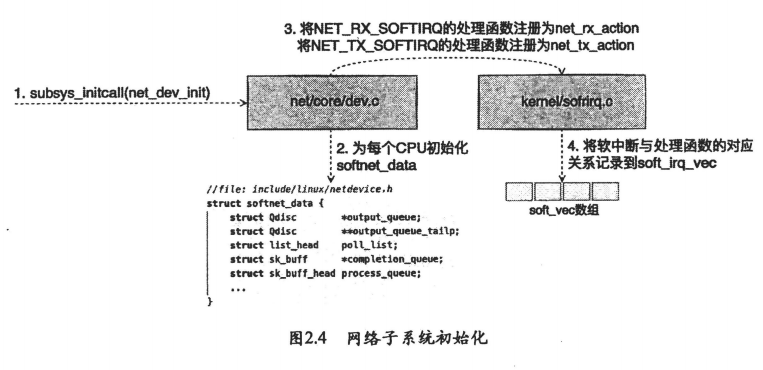

linux内核通过调用subsys_initcall来初始化各个子系统，网络子系统的初始化会执行net_dev_init函数

```
for_each_possible_cpu(i) {
	struct work_struct *flush = per_cpu_ptr(&flush_works, i);
	struct softnet_data *sd = &per_cpu(softnet_data, i);

	INIT_WORK(flush, flush_backlog);

	skb_queue_head_init(&sd->input_pkt_queue);
	skb_queue_head_init(&sd->process_queue);
```

这段代码的目的是为每个可能存在的 CPU 核心执行一些初始化操作，包括创建工作结构和初始化网络数据包队列。这通常用于在多处理器系统中配置和准备 CPU 核心以进行并行处理任务。

1. `for_each_possible_cpu(i)`：这是一个循环语句，它使用 `for_each_possible_cpu` 宏来遍历所有可能存在的 CPU 核心。它通过迭代变量 `i` 依次代表每个 CPU 核心。

2. `struct work_struct *flush = per_cpu_ptr(&flush_works, i);`：这行代码定义了一个指针 `flush`，它指向了一个特定 CPU 核心上的工作结构（`work_struct`）。`per_cpu_ptr` 宏用于获取每个 CPU 核心上的数据结构的指针。在这里，它获取了 `flush_works` 对象的特定 CPU 核心版本，并将其分配给 `flush` 指针。

3. `struct softnet_data *sd = &per_cpu(softnet_data, i);`：这行代码定义了一个指针 `sd`，它指向了一个特定 CPU 核心上的 `softnet_data` 结构体。类似地，`per_cpu` 宏用于获取每个 CPU 核心上的数据结构的实例，并将其分配给 `sd` 指针。

4. `INIT_WORK(flush, flush_backlog);`：这行代码用于初始化 `flush` 工作结构（`work_struct`）。`INIT_WORK` 宏设置了工作结构，指定了工作函数 `flush_backlog`，该函数将在工作队列中执行。

5. `skb_queue_head_init(&sd->input_pkt_queue);` 和 `skb_queue_head_init(&sd->process_queue);`：这两行代码分别用于初始化 `softnet_data` 结构体中的两个队列，即 `input_pkt_queue` 和 `process_queue`。这些队列通常用于管理网络数据包的接收和处理。

6. `&sd->process_queue` 取得的是成员 `process_queue` 在结构体 `sd` 中的地址

   

```
#ifdef CONFIG_XFRM_OFFLOAD
		skb_queue_head_init(&sd->xfrm_backlog);
#endif
		INIT_LIST_HEAD(&sd->poll_list);
		sd->output_queue_tailp = &sd->output_queue;
#ifdef CONFIG_RPS
		INIT_CSD(&sd->csd, rps_trigger_softirq, sd);
		sd->cpu = i;
#endif
```

1. `#ifdef CONFIG_XFRM_OFFLOAD` 和 `#endif`：这是条件编译的代码块，它检查是否已启用了名为 `CONFIG_XFRM_OFFLOAD` 的配置选项。如果已启用，则编译器将包括 `#ifdef` 和 `#endif` 之间的代码。如果未启用，这部分代码将被忽略。
2. `skb_queue_head_init(&sd->xfrm_backlog);`：如果已启用 `CONFIG_XFRM_OFFLOAD`，则这行代码初始化了名为 `xfrm_backlog` 的数据结构。这个结构可能用于管理与 XFRM（网络安全转换）相关的数据包处理。初始化函数 `skb_queue_head_init` 用于初始化队列。
3. `INIT_LIST_HEAD(&sd->poll_list);`：无论是否启用 `CONFIG_XFRM_OFFLOAD`，这行代码都会初始化名为 `poll_list` 的链表头（`list_head` 数据结构）。这个链表可能用于管理与轮询（polling）相关的操作。
4. `sd->output_queue_tailp = &sd->output_queue;`：这行代码将 `output_queue_tailp` 成员设置为指向 `output_queue` 的指针。这可能是为了初始化输出队列的尾部指针。
5. `#ifdef CONFIG_RPS` 和 `#endif`：类似于第一个条件编译块，这部分代码也检查是否已启用名为 `CONFIG_RPS` 的配置选项。如果已启用，将编译 `#ifdef` 和 `#endif` 之间的代码。
6. `INIT_CSD(&sd->csd, rps_trigger_softirq, sd);`：如果已启用 `CONFIG_RPS`，这行代码初始化了 `csd`（CPU SoftIRQ Data）结构，可能与 RPS（Receive Packet Steering）相关。这个初始化函数 `INIT_CSD` 设置了 `csd` 结构，包括指定了触发 RPS 软中断的函数和与该 CPU 相关的数据。
7. `sd->cpu = i;`：如果已启用 `CONFIG_RPS`，这行代码设置了 `sd` 结构的 `cpu` 成员，将其设置为当前循环迭代的 CPU 核心编号 `i`。

```
open_softirq(NET_TX_SOFTIRQ, net_tx_action);
open_softirq(NET_RX_SOFTIRQ, net_rx_action);
```

`open_softirq` 是Linux内核中的一个函数，用于初始化和注册软中断处理函数（Softirq）。软中断是一种轻量级的中断处理机制，通常用于在内核中处理异步事件。在你提供的代码片段中，`open_softirq` 函数用于初始化两个软中断：`NET_TX_SOFTIRQ` 和 `NET_RX_SOFTIRQ`，并分别关联了处理函数 `net_tx_action` 和 `net_rx_action`。

#### 协议栈注册

  内核实现了网络层的IP协议，也实现了传输层的TCP协议和UDP协议，其对应的函数分别是ip_rcv(),tco_v4_rcv,udp_rcv，内核通过注册的方式来实现。

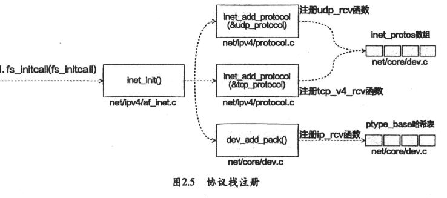

```
static struct packet_type ip_packet_type __read_mostly = {
	.type = cpu_to_be16(ETH_P_IP),
	.func = ip_rcv,
	.list_func = ip_list_rcv,
};
```

代码定义了一个用于处理IP数据包的数据包类型结构体，并指定了相应的处理函数。

- `type`：这个字段设置了数据包的类型，它使用了 `cpu_to_be16` 函数将以太网协议类型（ETH_P_IP）从主机字节顺序转换为网络字节顺序（big-endian）。以太网协议类型用于标识数据包的协议类型，而 `ETH_P_IP` 表示IP协议。
- `func`：这个字段指定了处理该类型数据包的函数，即 `ip_rcv`。这意味着当收到与指定类型匹配的数据包时，将调用 `ip_rcv` 函数来处理该数据包。
- `list_func`：这个字段指定了一个列表处理函数，即 `ip_list_rcv`。它与处理数据包的方式有关。

```
static const struct net_protocol tcp_protocol = {
	.handler	=	tcp_v4_rcv,
	.err_handler	=	tcp_v4_err,
	.no_policy	=	1,
	.icmp_strict_tag_validation = 1,
};

static const struct net_protocol udp_protocol = {
	.handler =	udp_rcv,
	.err_handler =	udp_err,
	.no_policy =	1,
};
```

这段代码片段定义了两个静态常量结构体：`tcp_protocol` 和 `udp_protocol`，它们用于表示TCP（传输控制协议）和UDP（用户数据报协议）的网络协议处理。

对于 `tcp_protocol` 结构体：

- `handler`：这个字段设置了TCP协议的数据包处理函数，即 `tcp_v4_rcv`。它指定了当收到TCP数据包时要执行的处理函数。
- `err_handler`：这个字段设置了TCP协议的错误处理函数，即 `tcp_v4_err`。它指定了处理TCP协议错误时要执行的函数。
- `no_policy`：这个字段被设置为1，这可能表示TCP协议不需要执行某些策略检查。
- `icmp_strict_tag_validation`：这个字段被设置为1，这可能表示启用了严格的 ICMP 标记验证。这通常用于安全性考虑，以确保 ICMP 报文的标记字段有效。

对于 `udp_protocol` 结构体：

- `handler`：这个字段设置了UDP协议的数据包处理函数，即 `udp_rcv`。它指定了当收到UDP数据包时要执行的处理函数。
- `err_handler`：这个字段设置了UDP协议的错误处理函数，即 `udp_err`。它指定了处理UDP协议错误时要执行的函数。
- `no_policy`：这个字段被设置为1，这可能表示UDP协议不需要执行某些策略检查

```
if (inet_add_protocol(&icmp_protocol, IPPROTO_ICMP) < 0)
	pr_crit("%s: Cannot add ICMP protocol\n", __func__);
if (inet_add_protocol(&udp_protocol, IPPROTO_UDP) < 0)
	pr_crit("%s: Cannot add UDP protocol\n", __func__);
if (inet_add_protocol(&tcp_protocol, IPPROTO_TCP) < 0)
	pr_crit("%s: Cannot add TCP protocol\n", __func__);
```

将网络协议处理程序添加到内核，以便处理不同协议的网络数据包。如果注册失败，代码将记录错误消息。

`inet_add_protocol(&icmp_protocol, IPPROTO_ICMP)`：这行代码的目的是将 ICMP 协议处理程序（`icmp_protocol`）注册到内核，并将其与协议号 `IPPROTO_ICMP` 相关联。具体来说：

- `inet_add_protocol` 是一个函数，用于将协议处理程序注册到内核的网络协议栈中。
- `&icmp_protocol` 是指向 `icmp_protocol` 结构体的指针，该结构体用于定义 ICMP 协议的处理方式。
- `IPPROTO_ICMP` 是一个常量，代表 ICMP 协议的协议号。

息。

```
int inet_add_protocol(const struct net_protocol *prot, unsigned char protocol)
{
    return !cmpxchg((const struct net_protocol **)&inet_protos[protocol],
                    NULL, prot) ? 0 : -1;
}

```


inet_add_protocol 是函数的名称，它接受两个参数：

- `prot`：一个指向 `struct net_protocol` 结构体的指针，表示要注册的网络协议的处理方式。
- `protocol`：一个 `unsigned char` 类型的参数，表示协议的协议号。

该函数的主要任务是将给定的网络协议处理程序注册到内核的网络协议栈中，以便处理特定的协议数据包。

在函数内部，它使用了以下操作：

- `cmpxchg`：这是一个原子操作，用于将给定的网络协议处理程序 `prot` 存储到 `inet_protos` 数组中的特定协议位置（由 `protocol` 参数指定的位置）。如果成功将 `prot` 存储到指定位置，`cmpxchg` 返回0，表示注册成功。如果指定位置已经被占用（不为NULL），则 `cmpxchg` 返回非零值，表示注册失败。
- 条件运算符 `? :`：根据 `cmpxchg` 的返回值，如果注册成功，函数返回0（表示成功），否则返回-1（表示失败）。

最后，通过 `EXPORT_SYMBOL(inet_add_protocol);`，该函数被导出为内核符号，以便其他模块或内核代码可以使用它。

总的来说，`inet_add_protocol` 函数的目的是注册网络协议处理程序到内核，并返回注册的结果。如果注册成功，它返回0；如果注册失败，它返回-1。这有助于内核动态地添加支持不同网络协议的功能。

#### 网卡驱动初始化

  每个驱动程序（不仅仅包括网卡驱动程序）会使用module_init向内核注册一个初始化函数，当驱动程序被加载时，内核会调用这个函数。igb网卡驱动程序的代码位于drivers/net/ethernet/intel/igb/igb_main.c中。 

```
static struct pci_driver igb_driver = {
	.name     = igb_driver_name,
	.id_table = igb_pci_tbl,
	.probe    = igb_probe,
	.remove   = igb_remove,
#ifdef CONFIG_PM
	.driver.pm = &igb_pm_ops,
#endif
	.shutdown = igb_shutdown,
	.sriov_configure = igb_pci_sriov_configure,
	.err_handler = &igb_err_handler
};
```

- `static struct pci_driver igb_driver`：这一行声明了一个静态结构体变量 `igb_driver`，其类型为 `struct pci_driver`。静态表示此结构体在文件范围内可见，但只能在当前文件中访问。
- `name`、`id_table`、`probe`、`remove`、`shutdown`、`sriov_configure`、`err_handler`：这些是结构体 `igb_driver` 的成员字段，每个字段用于存储相关的属性或函数指针。
- `igb_driver_name` 和 `igb_pci_tbl`：这些是已定义或外部定义的变量，用于初始化结构体成员字段。
- `igb_probe`、`igb_remove`、`igb_shutdown`、`igb_pci_sriov_configure`、`igb_err_handler` 和 `igb_pm_ops`：这些是函数指针或函数的名称，它们将在PCI驱动程序的不同阶段或情况下被调用。

根据上述代码片段，`igb_driver` 结构体用于描述与PCI设备相关的驱动程序信息和操作。


```
static int __init igb_init_module(void)
{
	int ret;

	pr_info("%s\n", igb_driver_string);
	pr_info("%s\n", igb_copyright);

#ifdef CONFIG_IGB_DCA
	dca_register_notify(&dca_notifier);
#endif
	ret = pci_register_driver(&igb_driver);
	return ret;
```

1. `static int __init igb_init_module(void)`：这是一个静态的初始化函数，用于初始化一个Linux内核模块。该函数返回一个整数值，通常用于指示初始化是否成功。

2. `int ret;`：这里声明了一个整数变量 `ret`，用于存储函数调用的返回值。

3. `pr_info("%s\n", igb_driver_string);` 和 `pr_info("%s\n", igb_copyright);`：这些语句使用 `pr_info` 函数输出信息到内核日志。它们用于打印驱动程序名称和版权信息到内核日志。

4. `%s` 是一个格式说明符，用于表示要输出的内容是一个字符串。

5. `\n` 是一个转义序列，表示换行符，用于在输出中创建新的一行。

6. `#ifdef CONFIG_IGB_DCA` 和 `dca_register_notify(&dca_notifier);`：这是条件编译的一部分，它检查是否定义了 `CONFIG_IGB_DCA` 宏。如果已定义，那么 `dca_register_notify(&dca_notifier);` 会被执行，该函数调用用于注册一个DCA（Direct Cache Access）通知。DCA是一种技术，允许PCI设备直接与CPU高速缓存进行交互，以提高性能。

   1. `dca_register_notify` 是一个用于在Linux内核中注册DCA通知的函数。DCA是一种技术，允许PCI设备直接与CPU高速缓存进行交互，以提高性能。

   2. `&dca_notifier` 是一个参数，它是一个指向 `dca_notifier` 结构体的指针。通常，DCA通知的注册需要提供一个指向包含通知回调函数等信息的结构体的指针，以便内核知道如何处理通知。

      这里的 `&dca_notifier` 是一个预先定义好的结构体变量，它包含有关DCA通知的信息，例如回调函数。

   3. 当 `dca_register_notify(&dca_notifier);` 被调用时，内核将使用传递的结构体信息来注册DCA通知。这通常意味着内核将调用指定的回调函数，以便在特定事件发生时执行相关操作。

7. `ret = pci_register_driver(&igb_driver);`：这一行代码调   用 `pci_register_driver` 函数来注册PCI设备驱动程序，该函数使用 `&igb_driver` 结构体变量作为参数，以将驱动程序注册到内核。注册驱动程序后，内核将使用 `igb_driver` 中的回调函数来处理PCI设备的探测和操作。

   1. `pci_register_driver` 是一个Linux内核函数，用于注册一个PCI设备驱动程序。这个函数接受一个指向 `struct pci_driver` 结构体的指针作为参数，该结构体包含了有关驱动程序的信息和回调函数。
   2. `&igb_driver` 是一个指向 `struct pci_driver` 结构体的指针，它是您定义的PCI设备驱动程序的结构体实例。这个结构体包含了与PCI设备相关的驱动程序信息，例如设备名称、设备探测函数、设备移除函数等。
   3. `ret` 是一个整数变量，用于存储 `pci_register_driver` 函数的返回值。这个返回值通常用于指示驱动程序注册是否成功。如果注册成功，`ret` 通常被设置为0，否则它将包含一个错误码，用于指示失败的原因。

   总的来说，这行代码的作用是将您的PCI设备驱动程序（由 `igb_driver` 结构体表示）注册到Linux内核中，以便内核能够在PCI设备与计算机通信时调用适当的回调函数（如探测函数、移除函数等）。成功的注册是确保PCI设备能够与操作系统正确交互的关键步骤之一。

   DCA（Direct Cache Access）和DMA（Direct Memory Access）都涉及计算机系统中的数据传输，但它们的原理和应用领域有明显的区别：

   1. **DCA（Direct Cache Access）的原理**：
      - **目标**：DCA的主要目标是优化CPU缓存与外设设备之间的数据传输。
      - **操作**：DCA通过将来自外设设备的数据（通常是传输写数据）直接放入CPU缓存中来实现。这样可以减少数据传输的延迟和CPU开销。
      - **优点**：DCA可以消除由于传入写操作而导致的缓存未命中，提高数据传输的效率，减少了CPU的介入。
      - **应用**：DCA通常用于特定情况下的高性能计算、网络和存储领域，以提高数据传输速度。
   2. **DMA（Direct Memory Access）的原理**：
      - **目标**：DMA的主要目标是允许外设设备直接访问系统内存，而无需CPU的介入。
      - **操作**：DMA控制器负责管理数据传输，它可以通过总线（如PCIe总线）直接与内存通信，从而将数据传输到或从内存中读取数据。
      - **优点**：DMA减少了CPU的负担，提高了系统性能，尤其在需要大规模数据传输的情况下。
      - **应用**：DMA广泛应用于各种I/O设备，包括硬盘、光驱、图形卡、网络适配器等，用于高效地进行数据传输。

   总的来说，DCA侧重于优化CPU缓存与外设设备之间的数据传输，目的是提高数据传输的速度和降低CPU开销。DMA则更广泛地用于各种I/O设备，它的主要目标是允许外设设备直接访问系统内存，以提高系统性能并降低CPU的负担。两者虽然在数据传输方面都有作用，但应用场景和实现方式有明显的区别。

   

最终，函数返回 `ret`，通常用于指示驱动程序初始化是否成功。如果返回0，则表示成功；如果返回其他值，则表示出现了错误。

驱动的pci_register_driver调用完成后，linux读取到了该驱动的相关信息，比如igb网卡的igb_driver_name和igb_probe函数地址等，当网卡设备被识别后，内核会调用其驱动的probe（设备探测）方法，其目的就是让设备处于ready状态。

以下是 "probe" 过程的一些关键点：

1. **设备探测（Probe）**："probe" 是设备探测的缩写。在设备探测阶段，驱动程序会检查系统中的硬件设备，以确定是否有与其匹配的设备存在。这通常涉及到检查设备的硬件标识符、厂商ID、设备ID等信息。
2. **设备初始化**：一旦匹配的设备被发现，"probe" 函数会执行设备的初始化。这包括为设备分配资源、设置设备的工作模式和配置参数、注册设备等操作。
3. **返回值**："probe" 函数通常会返回一个整数值，用于指示设备探测的结果。如果设备成功探测并初始化，通常会返回0，表示成功。如果探测失败，通常会返回一个错误码，以便操作系统知道出了什么问题。
4. **设备管理**：一旦设备成功初始化，内核会管理设备的状态，包括在设备被卸载时执行相应的清理操作。

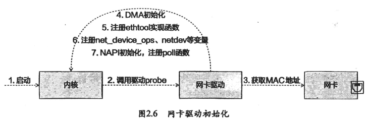

在第五步，网卡驱动实现了ethtool所需要的接口，也完成函数地址注册。当ethtool发起一个系统调用后，内核会找到对应操作的回调函数。ethtool命令之所以能查看网卡收发包统计，修改网卡自适应模式等是因为ethtool命令最终调用到了网卡驱动的相应方法。

```
netif_napi_add(adapter->netdev, &q_vector->napi, igb_poll);
```
这行代码用于在Linux内核中为一个网络设备启用NAPI（New API）支持，并将 igb_poll 函数与网络设备的NAPI操作关联起来。详细解释：

1. `netif_napi_add`：这是一个Linux内核中的函数，用于向一个网络设备添加NAPI支持。NAPI是一种高性能网络接收处理机制，允许网络设备的接收数据流异步处理，以提高网络性能。
2. `adapter->netdev`：这是一个指向网络设备结构体的指针，表示要添加NAPI支持的网络设备。`adapter` 可能是一个包含了网络设备结构体指针的结构体或数据结构。
3. `&q_vector->napi`：这是一个指向NAPI数据结构的指针。NAPI数据结构用于管理NAPI的状态和工作队列。
4. `igb_poll`：这是一个指向函数的指针，它通常是用于网络设备的中断处理程序函数。当网络设备接收到数据时，中断处理程序将调用此函数来处理接收到的数据包。

通过调用 `netif_napi_add` 函数，内核将启用NAPI支持，并将指定的中断处理程序函数 `igb_poll` 与指定的网络设备 `adapter->netdev` 相关联。这有助于改善网络设备的性能，特别是在高负载情况下，因为它允许网络设备异步地处理接收数据包，而不需要每个数据包都触发中断。

##### poll

1. **接收路径中的轮询（RX Polling）**：在接收数据包的路径中，网络驱动程序可以周期性地轮询硬件设备的接收缓冲区，以检查是否有新的数据包到达。这种轮询机制可以减少中断的频率，提高系统性能。
2. **发送路径中的轮询（TX Polling）**：在发送数据包的路径中，网络驱动程序可以周期性地轮询发送队列，以检查是否有数据包等待发送。这也有助于减少中断负载，提高性能。
3. **轮询定时器**：通常，网络驱动程序会使用定时器机制，定期触发轮询操作。这个定时器可以根据网络流量的情况进行配置，以在需要时执行轮询操作。
4. **与NAPI的关系**：有时，网络驱动程序中的轮询机制与NAPI（New API）一起使用。NAPI机制允许网络设备异步地处理接收数据，而轮询可以用于优化NAPI的性能。
5. **性能优化**：使用轮询机制可以有效地减少中断的频率，降低系统的上下文切换成本，并提高网络设备的性能。但需要谨慎使用，因为它也可能引入一些延迟。

总之，"poll" 在网络驱动程序中通常是指一种周期性轮询机制，用于检查网络设备的状态和数据包的到达情况，以提高网络性能和减少中断负载。这种机制通常与NAPI和定时器一起使用，以实现高效的网络数据处理。不同的网络设备驱动程序可能会有不同的实现方式和优化策略。

##### NAPI

NAPI（New API）的原理涉及减少网络设备接收数据包时的中断频率和提高网络性能的方法。以下是NAPI的基本原理：

1. **中断处理优化**：在传统的网络接收中，每个接收到的数据包都会触发一个中断，导致大量的上下文切换和中断处理。这会在高速网络上引入显著的性能开销。NAPI的首要目标是减少这种中断频率。
2. **轮询模式**：NAPI采用一种轮询模式，使网络设备能够在异步模式下接收数据包，而不是每个数据包都触发中断。这意味着数据包在接收到后，它们不会立即触发中断，而是由网络设备驱动程序在适当的时候进行处理。
3. **网络设备状态检查**：NAPI通常与轮询机制结合使用。网络设备驱动程序会周期性地检查接收队列中是否有数据包可用，而不是等待中断触发。这种轮询操作允许驱动程序有效地扫描接收队列，以发现新的数据包。
4. **延迟处理**：接收到的数据包通常不会立即处理，而是在稍后的时间内批量处理。这减少了中断的数量，从而降低了系统负载。
5. **性能提升**：通过减少中断处理和上下文切换的开销，NAPI可以显著提高系统的网络吞吐量和性能。这对于高速网络环境非常重要。
6. **适用性**：NAPI通常用于高速网络设备，如千兆位以太网和更高速率的网络。对于较低速率的网络设备，传统的中断处理可能足够高效。

总之，NAPI的原理在于将网络接收的操作异步化，减少中断的频率，以提高系统的网络性能。它通过轮询网络设备的接收队列来实现延迟处理，从而降低了系统开销，特别适用于高速网络环境。 NAPI的实现通常依赖于网络设备驱动程序的支持和配置。

##### 启动网卡

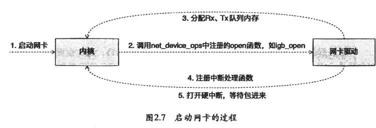

```
static int __igb_open(struct net_device *netdev, bool resuming)
{
	struct igb_adapter *adapter = netdev_priv(netdev);
	struct e1000_hw *hw = &adapter->hw;
	struct pci_dev *pdev = adapter->pdev;
	int err;
	int i;
```

1. `__igb_open`：这是一个网络设备驱动程序中的函数，用于打开（初始化）网络设备。通常，这个函数会在网络设备启动时被调用。
2. `struct net_device *netdev`：这是一个指向网络设备的指针，表示要打开的网络设备。网络设备是Linux内核中用于管理网络接口的数据结构。
3. `struct igb_adapter *adapter = netdev_priv(netdev);`：这一行通过 `netdev_priv` 宏获取了网络设备私有数据，将其存储在 `struct igb_adapter` 类型的指针 `adapter` 中。通常，网络设备驱动程序会在网络设备结构中包含一个指向其私有数据的指针，以便在函数中使用。
4. `struct e1000_hw *hw = &adapter->hw;`：这一行将指向网络设备硬件信息的指针 `hw` 初始化为指向 `adapter->hw` 的地址。硬件信息结构通常包含与网络设备底层硬件相关的配置和状态信息。
5. `struct pci_dev *pdev = adapter->pdev;`：这一行将指向PCI设备的指针 `pdev` 初始化为指向 `adapter->pdev` 的地址。这是因为网络设备通常与PCI总线相关，需要访问PCI设备信息。
6. `adapter->pdev` 本身就是一个指向 `struct pci_dev` 结构体的指针
7. `int err;` 和 `int i;`：这两行声明了两个整数变量 `err` 和 `i`，这些变量可能在函数的后续部分用于存储错误代码或迭代计数器等信息。

这段代码的目标是初始化网络设备的驱动程序，并为后续的网络设备操作做好准备。接下来的代码将继续执行网络设备的初始化和配置，以确保网络设备可以正常运行。请注意，具体的网络设备驱动程序可能会有不同的实现细节和配置要求。

```
	/* allocate transmit descriptors */
	//分配传输描述符数组
	err = igb_setup_all_tx_resources(adapter);
	if (err)
		goto err_setup_tx;
    //分配接受描述符数组
	/* allocate receive descriptors */
	err = igb_setup_all_rx_resources(adapter);
	if (err)
		goto err_setup_rx;
    //电源恢复
	igb_power_up_link(adapter);
	//注册中断处理函数
	err = igb_request_irq(adapter);
if (err)
	goto err_req_irq;
```

1. `err = igb_setup_all_tx_resources(adapter);`：这一行代码调用了名为 `igb_setup_all_tx_resources` 的函数，该函数的目的是为网络设备分配和配置传输（发送）资源，这些资源包括传输描述符、传输环等。函数会返回一个错误代码，将其赋值给 `err` 变量。
2. `if (err)`：在这一行，代码检查 `err` 变量的值是否为非零。如果 `igb_setup_all_tx_resources` 函数执行过程中发生了错误，`err` 变量将包含一个非零值。
3. `goto err_setup_tx;`：如果 `err` 变量为非零，那么代码将跳转到标签 `err_setup_tx` 处。这是一种错误处理机制，表示在发生错误时执行特定的错误处理步骤。

总的来说，这段代码的作用是执行传输资源的初始化操作，并在初始化过程中检查是否发生了错误。如果发生了错误，它将跳转到 `err_setup_tx` 标签处执行错误处理步骤，这通常包括释放已分配的资源、报告错误、进行清理等操作，以确保网络设备的正确初始化。如果没有错误发生，代码将继续执行后续的操作。

`adapter` 参数在这个函数中的作用是将函数与特定的网络设备适配器实例关联起来，以便在函数内部可以访问和操作该网络设备的相关信息和资源。具体来说，`adapter` 参数通常代表了一个指向 `struct igb_adapter` 或类似结构的指针，其中包含了关于网络设备的各种属性、配置和状态信息。

`igb_setup_all_tx_resources(adapter)` 是用于检查并执行网络设备的传输（发送）资源分配和配置的函数。函数的名称中包含了 "tx"，通常表示传输（发送）操作。

这个函数的主要任务通常包括以下内容：

1. 分配传输描述符（Transmit Descriptors）：传输描述符是用于管理要发送的数据包的数据结构，该函数通常会分配一定数量的传输描述符。
2. 配置传输环（Transmit Ring）：传输环是用于存储数据包的缓冲区，该函数通常会配置传输环的大小和其他相关参数。
3. 初始化传输控制寄存器和寄存器位：该函数通常会初始化网络设备的传输控制寄存器和寄存器位，以确保传输操作正常进行。
4. 错误处理：如果在分配和配置传输资源的过程中发生错误，函数通常会返回一个错误代码，表示分配和配置失败。

在函数内部，`adapter` 参数用于以下目的：

1. **访问网络设备的属性**：通过 `adapter` 参数，函数可以访问网络设备的各种属性，例如硬件信息、MAC地址、配置选项等。
2. **管理网络设备的状态**：函数可以使用 `adapter` 参数来管理网络设备的状态，例如启用或禁用网络设备、设置链路状态等。
3. **操作网络设备的资源**：在初始化或配置网络设备的过程中，函数可能需要分配、配置和管理网络设备的资源，例如传输描述符、接收缓冲区等。`adapter` 参数用于确定将这些资源分配给哪个具体的网络设备。
4. **执行错误处理**：如果在函数内部发生错误，函数通常会使用 `adapter` 参数来报告错误、释放资源并执行其他错误处理操作，以确保网络设备的稳定性和可靠性。

综上所述，`adapter` 参数在函数内部充当了与特定网络设备实例相关联的关键指针，使函数能够与该设备进行交互和管理，以实现适当的初始化和配置。这种参数传递方式有助于驱动程序支持多个不同的网络设备实例，同时确保每个实例都能够正确地初始化和配置。igb_open函数调用igb_setup_all_tx_resources和igb_setup_all_rx_resources。在调用igb_setup_all_rx_resources中分配了RingBuffer,并建立内存和RX队列映射关系（RX和TX队列的数量和大小可以通过ethtool进行配置）


```
static int igb_setup_all_tx_resources(struct igb_adapter *adapter)
{
	struct pci_dev *pdev = adapter->pdev;
	int i, err = 0;

	for (i = 0; i < adapter->num_tx_queues; i++) {
		err = igb_setup_tx_resources(adapter->tx_ring[i]);
		if (err) {
			dev_err(&pdev->dev,
				"Allocation for Tx Queue %u failed\n", i);
			for (i--; i >= 0; i--)
				igb_free_tx_resources(adapter->tx_ring[i]);
			break;
		}
	}

	return err;
}
```

这段代码是一个函数，用于为指定的网络设备适配器 (`adapter`) 的所有传输（发送）队列分配和配置资源。下面是对这段代码的详细解释：

1. `struct pci_dev *pdev = adapter->pdev;`：这行代码创建一个指向PCI设备的指针 `pdev`，并将其初始化为 `adapter` 结构体中的 `pdev` 成员。这是为了后续可能需要访问PCI设备相关信息而做的准备。
2. `int i, err = 0;`：在这行代码中，声明了一个整数变量 `i` 用于循环计数，以及一个整数变量 `err` 并将其初始化为零。`err` 用于存储函数执行过程中的错误代码，初始化为零表示尚未发生错误。
3. `for (i = 0; i < adapter->num_tx_queues; i++)`：这是一个循环，用于遍历网络设备适配器中的所有传输队列。`adapter->num_tx_queues` 表示传输队列的数量，`i` 用于迭代每个队列。
4. `err = igb_setup_tx_resources(adapter->tx_ring[i]);`：在循环内部，这行代码调用 `igb_setup_tx_resources` 函数，用于为当前传输队列分配和配置资源。函数返回的错误代码被存储在 `err` 变量中。
5. `if (err)`：在检查完传输队列的资源分配后，这行代码检查 `err` 是否为非零，即是否发生了错误。
6. `dev_err(&pdev->dev, "Allocation for Tx Queue %u failed\n", i);`：如果发生了错误，这行代码使用 `dev_err` 函数输出错误消息，通知发生错误的传输队列的编号。
7. `for (i--; i >= 0; i--) igb_free_tx_resources(adapter->tx_ring[i]);`：如果在分配资源的过程中发生了错误，这段代码执行了错误处理步骤。它会逆向遍历已经成功分配资源的传输队列，调用 `igb_free_tx_resources` 函数释放它们。这是为了确保在出现错误时释放已分配的资源，以避免资源泄漏。
8. 最后，函数返回 `err`，这个值可能是零（表示成功）或一个非零错误代码（表示发生了错误）。

总之，这个函数的主要作用是为网络设备适配器的所有传输队列分配和配置资源，如果在分配或配置过程中发生错误，它会释放已分配的资源并返回错误代码。

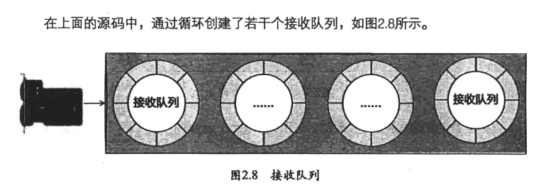

每一个队列的创建：

```
int igb_setup_rx_resources(struct igb_ring *rx_ring)
{
	struct igb_adapter *adapter = netdev_priv(rx_ring->netdev);
	struct device *dev = rx_ring->dev;
	int size, res;

	/* XDP RX-queue info */
	if (xdp_rxq_info_is_reg(&rx_ring->xdp_rxq))
		xdp_rxq_info_unreg(&rx_ring->xdp_rxq);
	res = xdp_rxq_info_reg(&rx_ring->xdp_rxq, rx_ring->netdev,
			       rx_ring->queue_index, 0);
	if (res < 0) {
		dev_err(dev, "Failed to register xdp_rxq index %u\n",
			rx_ring->queue_index);
		return res;
	}

	size = sizeof(struct igb_rx_buffer) * rx_ring->count;

	rx_ring->rx_buffer_info = vmalloc(size);
	if (!rx_ring->rx_buffer_info)
		goto err;

	/* Round up to nearest 4K */
	rx_ring->size = rx_ring->count * sizeof(union e1000_adv_rx_desc);
	rx_ring->size = ALIGN(rx_ring->size, 4096);

	rx_ring->desc = dma_alloc_coherent(dev, rx_ring->size,
					   &rx_ring->dma, GFP_KERNEL);
	if (!rx_ring->desc)
		goto err;

	rx_ring->next_to_alloc = 0;
	rx_ring->next_to_clean = 0;
	rx_ring->next_to_use = 0;

	rx_ring->xdp_prog = adapter->xdp_prog;

	return 0;
```

这段代码是用于设置接收（Rx）资源的函数 `igb_setup_rx_resources`，它被用于网络设备驱动程序中。以下是对这段代码的详细解释：

1. `struct igb_adapter *adapter = netdev_priv(rx_ring->netdev);`：这行代码声明并初始化了一个指向 `struct igb_adapter` 结构的指针 `adapter`。它使用 `netdev_priv` 宏从给定的 `rx_ring` 结构中提取网络设备适配器的指针。这是为了在后续代码中可以使用 `adapter` 来访问网络设备适配器的属性和配置。

2. `struct device *dev = rx_ring->dev;`：这行代码声明了一个指向设备结构的指针 `dev`，并将其初始化为 `rx_ring` 结构中的设备指针。`rx_ring` 结构通常代表网络设备的一个接收队列，而 `dev` 是与该队列相关的设备。

3. `if (xdp_rxq_info_is_reg(&rx_ring->xdp_rxq))`：这是一个条件语句，检查是否已经注册了XDP（eXpress Data Path）接收队列信息。XDP是一种高性能数据包处理框架。如果已经注册了XDP接收队列信息，则会执行解注册操作。

4. `res = xdp_rxq_info_reg(&rx_ring->xdp_rxq, rx_ring->netdev, rx_ring->queue_index, 0);`：这行代码用于注册XDP接收队列信息。如果注册失败，它会返回一个负数错误代码，并输出相应的错误消息。

5. `size = sizeof(struct igb_rx_buffer) * rx_ring->count;`：计算接收队列缓冲区的大小。`rx_ring->count` 表示缓冲区的数量。

6. `rx_ring->rx_buffer_info = vmalloc(size);`：这行代码使用 `vmalloc` 分配一块大小为 `size` 字节的虚拟内存，用于存储接收缓冲区的信息。如果分配失败，它会执行错误处理操作。

7. `rx_ring->size = rx_ring->count * sizeof(union e1000_adv_rx_desc);`：计算接收队列描述符数组的大小，其中 `rx_ring->count` 表示描述符的数量。

8. `rx_ring->size = ALIGN(rx_ring->size, 4096);`：将描述符数组的大小向上舍入到最接近的4K边界。这通常是出于性能和内存对齐的考虑。

9. `rx_ring->desc = dma_alloc_coherent(dev, rx_ring->size, &rx_ring->dma, GFP_KERNEL);`：这行代码使用 `dma_alloc_coherent` 分配了一块与物理内存对应的内存区域，用于存储接收队列的描述符。`&rx_ring->dma` 用于获取描述符内存区域的DMA（Direct Memory Access）地址。

10. 接下来的几行代码用于初始化接收队列的各种计数和指针，以及分配的内存区域的相关信息。

11. `rx_ring->xdp_prog = adapter->xdp_prog;`：这行代码将接收队列的XDP程序设置为适配器的XDP程序，以确保接收队列能够正确处理数据包。

12. 最后，函数返回0，表示成功分配和配置接收资源。如果在上述任何步骤中出现错误，函数会在相应位置返回适当的错误代码，以便进行错误处理。

    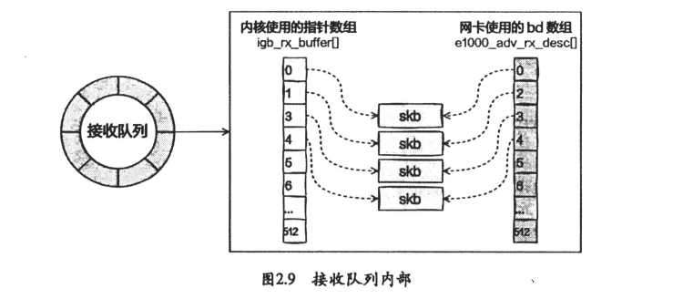
    
    `skb` 是Linux内核网络子系统中常用的数据结构，代表了一个网络数据包的缓冲区。`skb` 是 "Socket Buffer" 的缩写，它在网络通信中起着重要的作用，特别是在Linux上。
    
    以下是有关 `skb` 结构的一些关键信息：
    
    1. **缓冲区**：`skb` 是一个数据包的缓冲区，用于存储网络数据包的内容和相关的控制信息。
    2. **网络协议**：`skb` 可以存储不同网络协议（如TCP、UDP、IP等）的数据包。内核通过 `skb` 结构来表示和处理这些数据包。
    3. **数据结构**：`skb` 是一个包含各种字段和指针的复杂数据结构，用于存储数据包的不同部分和与之相关的元数据。它通常包括数据指针、长度、协议标志、头部和尾部指针等信息。
    4. **操作**：内核和网络驱动程序可以使用 `skb` 来执行各种操作，例如接收、发送、路由、分析和修改数据包。这使得 `skb` 成为网络数据包在内核中流动和处理的关键数据结构。
    5. **分配和释放**：在接收或发送数据包时，内核通常需要分配新的 `skb` 结构来容纳数据。一旦数据包被处理完毕，`skb` 可以被释放以避免内存泄漏。
    6. **链表**：多个 `skb` 结构可以连接成一个链表，以便按顺序处理数据包。这种链表通常用于接收队列或发送队列中，以提高网络数据包的处理效率。
    
    `skb` 结构的使用广泛分布在Linux内核的网络子系统中，包括网络协议栈、驱动程序、路由、防火墙和其他网络相关的功能。这个结构使得Linux能够高效地处理各种网络数据包，从而支持了互联网连接和通信的核心功能。

中断函数的注册

```
static int igb_request_irq(struct igb_adapter *adapter)
{
	struct net_device *netdev = adapter->netdev;
	struct pci_dev *pdev = adapter->pdev;
	int err = 0;

	if (adapter->flags & IGB_FLAG_HAS_MSIX) {
		err = igb_request_msix(adapter);
		if (!err)
			goto request_done;
```

1. `struct igb_adapter *adapter`是传递给函数的`igb_adapter`结构的指针，表示Intel Gigabit Ethernet适配器的配置和状态。
2. `struct net_device *netdev = adapter->netdev;` 和 `struct pci_dev *pdev = adapter->pdev;` 这两行代码是从适配器结构中提取网络设备和PCI设备的指针，以便在后续的操作中使用它们。
3. `int err = 0;` 声明一个整数类型的变量`err`，并将其初始化为0。这个变量将用于存储函数执行过程中的错误状态。
4. 接下来，代码检查适配器的标志位（flags）是否包含`IGB_FLAG_HAS_MSIX`。这个标志位通常用于表示适配器是否支持多消息中断（MSI-X）技术。
5. 如果适配器的`IGB_FLAG_HAS_MSIX`标志被设置，代码会调用`igb_request_msix`函数，该函数的目的是请求MSI-X中断资源。如果`igb_request_msix`函数执行成功，它将返回0，否则将返回一个非零错误代码。
6. 如果`err`的值为0，表示`igb_request_msix`函数执行成功，代码会跳转到`request_done`标签。这通常意味着已成功请求了适配器的中断资源，并且可以继续进行后续的初始化或配置步骤。

这段代码的主要目的是根据适配器的硬件支持情况请求中断资源。如果适配器支持MSI-X中断，它将尝试请求这些中断资源，并在成功时将`err`设置为0，然后跳转到`request_done`标签，表示中断资源请求已经完成。如果适配器不支持MSI-X中断，那么这段代码会执行其他操作。

多消息中断（MSI-X）技术：

1. **多消息中断**：传统的IRQ机制允许每个设备使用一个中断线，而MSI-X允许设备发送多个独立的中断消息。每个消息都与设备的特定事件相关联，这意味着不同的事件可以引发不同的中断消息。这提供了更细粒度的中断控制，减少了中断争用问题。
2. **多队列支持**：MSI-X允许每个设备拥有多个中断消息队列，每个队列可以与不同的处理器核心或线程相关联。这允许并行处理中断，提高了系统的性能。
3. **配置灵活性**：MSI-X允许操作系统和设备之间更灵活地协商中断处理方式。操作系统可以配置每个设备的中断行为，以满足性能和可靠性需求。
4. **减少中断负载**：通过将中断消息直接发送到特定的处理器核心或线程，MSI-X可以减少中断负载的分布，从而减少了中断处理的开销。

```
err = request_irq(adapter->msix_entries[vector].vector,
			  igb_msix_other, 0, netdev->name, adapter);
	if (err)
		goto err_out;

```

这部分代码使用 `request_irq` 函数请求一个 MSI-X 中断向量，用于处理与网络适配器的其他操作相关的中断事件。以下是这部分代码的详细解释：

1. `request_irq` 函数：这是 Linux 内核提供的函数，用于请求一个中断服务例程 (IRQ handler)。它是中断处理程序的注册函数，用于告诉内核在特定中断号上触发中断时应该调用哪个函数。
2. `adapter->msix_entries[vector].vector`：这是请求的 MSI-X 中断向量的向量号（vector number）。`adapter` 是一个指向 `struct igb_adapter` 结构的指针，`msix_entries` 是一个数组，包含了所有 MSI-X 中断向量的信息，通过 `vector` 变量索引到特定的向量。
3. `igb_msix_other`：这是一个函数指针，它指向处理其他操作相关中断事件的中断服务例程。当请求的 MSI-X 中断向量触发时，内核将调用此函数来处理中断事件。
4. `0`：这是一个标志，通常用于指定中断处理程序的标志。在这里，`0` 表示没有特殊标志。
5. `netdev->name`：这是请求中断向量时指定的中断处理程序的名称。`netdev` 是一个指向网络设备的指针，`name` 是网络设备的名称。
6. `adapter`：这是传递给中断处理程序的参数，通常是一个指向适配器或设备的指针。在中断处理程序中，您可以使用此参数来访问适配器的相关信息。
7. `err = request_irq(...)`：这一行代码尝试请求指定的 MSI-X 中断向量，并将结果存储在 `err` 变量中。如果请求成功，`err` 的值将为 0，如果请求失败，`err` 的值将为一个负数，表示错误码。
8. `if (err)`：这是一个条件语句，用于检查 `request_irq` 函数的返回值。如果 `err` 不等于 0（即请求失败），则会执行下面的 `goto err_out` 语句。
9. `goto err_out`：如果请求中断向量失败，控制流将跳转到 `err_out` 标签，以便处理错误情况。在 `err_out` 部分，您可能会找到释放资源、记录错误或执行其他必要的清理操作。

总结来说，这段代码请求一个 MSI-X 中断向量，并将指定的中断处理程序 (`igb_msix_other`) 分配给它，以便在中断事件发生时调用该处理程序。如果请求失败，将执行错误处理代码。这是网络适配器初始化过程的一部分，以确保适配器的中断处理正确设置。

```
User
if (num_q_vectors > MAX_Q_VECTORS) {
		num_q_vectors = MAX_Q_VECTORS;
		dev_warn(&adapter->pdev->dev,
			 "The number of queue vectors (%d) is higher than max allowed (%d)\n",
			 adapter->num_q_vectors, MAX_Q_VECTORS);
	}
```


这段代码片段执行了以下操作：

1. 首先，它检查 `num_q_vectors` 变量的值是否大于 `MAX_Q_VECTORS`，这是一个预定义的最大队列向量数的常量。
2. 如果 `num_q_vectors` 大于 `MAX_Q_VECTORS`，则将 `num_q_vectors` 的值修改为 `MAX_Q_VECTORS`，以确保不会请求超过系统所允许的最大队列向量数量。
3. 接下来，它使用 `dev_warn` 函数生成一条警告消息，向开发人员或系统管理员报告队列向量数量超过了系统允许的最大值。这条警告消息包含了两个信息：
   - `"The number of queue vectors (%d) is higher than max allowed (%d)\n"`：这是警告消息的格式字符串，其中 `%d` 是占位符，分别用于插入 `adapter->num_q_vectors` 和 `MAX_Q_VECTORS` 的值。
   - `adapter->num_q_vectors`：表示当前队列向量的数量。
   - `MAX_Q_VECTORS`：表示系统所允许的最大队列向量数量。

总之，这段代码的目的是确保队列向量的数量不会超过系统允许的最大值 `MAX_Q_VECTORS`，并在超过最大值时生成一条警告消息以提醒开发人员或系统管理员。这是一种良好的健壮性措施，可以防止队列向量数量超出系统的处理能力。

```
for (i = 0; i < num_q_vectors; i++) {
		struct igb_q_vector *q_vector = adapter->q_vector[i];

		vector++;

		q_vector->itr_register = adapter->io_addr + E1000_EITR(vector);
```

这段代码是在一个循环中遍历适配器中的队列向量，并为每个队列向量设置 `itr_register` 字段的值。以下是代码的详细解释：

1. `for` 循环：这是一个 `for` 循环，从 `i = 0` 开始，一直循环到 `i` 的值小于 `num_q_vectors`。`num_q_vectors` 表示队列向量的数量，通常由适配器的驱动程序或配置文件设置。
2. `struct igb_q_vector *q_vector`：在循环中，定义了一个指向 `struct igb_q_vector` 结构的指针变量 `q_vector`，用于表示当前迭代的队列向量。`q_vector` 变量被设置为指向 `adapter` 中的一个特定队列向量，以便后续的操作可以访问和配置该队列向量的属性和参数。这种方式允许在循环中逐个处理不同的队列向量，以执行特定的任务或配置操作。
3. `vector++`：在每次循环迭代中，`vector` 变量的值会增加 1。`vector` 变量用于跟踪 MSI-X 中断向量的索引，以便正确分配和配置中断向量。
4. `q_vector->itr_register`：这一行代码设置了当前队列向量的 `itr_register` 字段的值。`itr_register` 通常表示中断节拍周期的寄存器，用于控制中断间隔时间。这里的计算方法是将适配器的 `io_addr` 和 `E1000_EITR(vector)` 相加，以得到正确的 `itr_register` 地址。

总结来说，这段代码的目的是遍历适配器中的队列向量，并为每个队列向量设置 `itr_register` 字段的值，以便控制中断的触发时间间隔。这有助于调整中断处理的性能和效率，以适应不同的工作负载和需求。


总体来说调用顺序：_igb_open => igb_request_irq=>igb_request_msix。在igb_request_msix中对于多队列网卡，为每个队列都注册了中断，其对应的中断函数是igb_msix_ring。


#### 迎接数据的到来

##### 硬中断处理

当数据帧从网线到达网卡上时，第一站时网卡的接受队列。网卡在分配给自己的RingBuffer中寻找可用的内存位置。找到后网卡把帧DMA关联到内存，到此时CPU无感的，当DMA操作完成后，网卡会向CPU发起一个硬中断，通知CPU有数据到达。

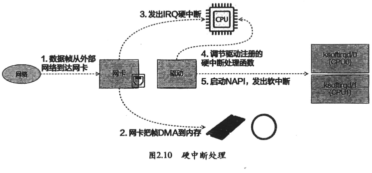

当RingBuffer满了的时候，新来的数据包将被丢弃。使用ifconfig命令查看网卡时可以看到overruns，表示因为环形队列满被丢弃的包数，若发现有丢包，可能需要通过ethtool命令来加大环形队列的长度.

```
static irqreturn_t igb_msix_ring(int irq, void *data)
{
	struct igb_q_vector *q_vector = data;

	/* Write the ITR value calculated from the previous interrupt. */
	igb_write_itr(q_vector);

	napi_schedule(&q_vector->napi);

	return IRQ_HANDLED;
}
```


这段代码定义了一个 IRQ（中断请求）处理程序函数，通常用于处理 MSI-X 中断向量引发的中断事件。以下是这段代码的详细解释：

- `static irqreturn_t igb_msix_ring(int irq, void *data)`：这是一个 IRQ 处理程序函数的定义。该函数在 IRQ 中断发生时被内核调用。
- `irq`：这是中断请求号，表示触发中断的具体中断线。
- `void *data`：这是一个指向数据的指针，通常包含了与中断事件相关的上下文信息。在这里，`data` 指针指向一个 `struct igb_q_vector` 结构，该结构用于表示与队列向量相关的信息。
- `igb_write_itr(q_vector)`：这行代码调用了 `igb_write_itr` 函数，用于写入 ITR（中断节拍周期）的值。ITR 控制中断间隔时间，记录硬件冲断频率,可以根据上一个中断事件的处理情况进行动态调整。在这里，`q_vector` 表示与中断事件相关的队列向量，`igb_write_itr` 函数将根据队列向量的状态计算并设置正确的 ITR 值。
- `napi_schedule(&q_vector->napi)`：这行代码调用了 `napi_schedule` 函数，用于安排网络 NAPI（New API）调度，以便在适当的时候执行网络接收处理。`q_vector->napi` 表示与中断事件相关的 NAPI 结构。
- `return IRQ_HANDLED`：这行代码表示中断事件已经被处理，可以返回 `IRQ_HANDLED`，告诉内核中断已经被处理完毕。

总结来说，这段代码表示当 MSI-X 中断向量引发中断时，将调用 `igb_msix_ring` 函数来处理中断事件。在处理事件期间，它会执行一些操作，例如设置中断节拍周期（ITR）、安排网络 NAPI 调度等，然后返回 `IRQ_HANDLED` 表示中断已被成功处理。这有助于确保中断事件的及时处理和系统性能的优化。


```
list_add_tail(&napi->poll_list, &sd->poll_list);
	WRITE_ONCE(napi->list_owner, smp_processor_id());
```

1. `list_add_tail(&napi->poll_list, &sd->poll_list);`：这行代码使用 `list_add_tail` 函数将一个名为 `poll_list` 的链表节点（表示网络 NAPI 处理程序）添加到 `sd->poll_list` 链表的末尾。这通常用于将一个新的 NAPI 处理程序添加到网络数据包轮询列表中，以便后续可以处理网络数据包。
2. `WRITE_ONCE(napi->list_owner, smp_processor_id());`：这行代码使用 `WRITE_ONCE` 宏将 `list_owner` 字段的值设置为当前 CPU 的 ID（核心号）。这个字段通常用于跟踪哪个 CPU 正在处理网络 NAPI 处理程序。`smp_processor_id()` 函数返回当前 CPU 的 ID。`WRITE_ONCE` 宏用于确保字段的写入是原子的，以防止竞态条件。

综合起来，这段代码的目的是将一个新的网络 NAPI 处理程序添加到网络数据包轮询列表中，并设置 `list_owner` 字段以标识哪个 CPU 正在处理该处理程序。这有助于实现多核系统中的网络数据包处理并确保处理程序之间的正确协调。

```

void __raise_softirq_irqoff(unsigned int nr)
{
	lockdep_assert_irqs_disabled();
	trace_softirq_raise(nr);
	or_softirq_pending(1UL << nr);
}
```

这段代码实现了一个函数 `__raise_softirq_irqoff`，用于在禁用中断的情况下触发（raise）一个软中断（softirq）。以下是这段代码的详细解释：

- `void __raise_softirq_irqoff(unsigned int nr)`：这是函数的声明，它接受一个参数 `nr`，表示要触发的软中断号（softirq number）。
- `lockdep_assert_irqs_disabled()`：这是一个断言，用于确保在调用这个函数时中断已经被禁用。软中断通常在禁用中断的上下文中触发，以确保它们在执行时不会被其他中断干扰。
- `trace_softirq_raise(nr)`：这行代码可能是用于记录软中断触发事件的跟踪信息。它会调用一个跟踪函数，以便在系统中跟踪软中断的触发。
- `or_softirq_pending(1UL << nr)`：这行代码用于设置软中断的挂起位（pending bit）。软中断的挂起位表示该软中断当前处于待处理状态。`1UL << nr` 表示将软中断号 `nr` 对应的位设置为 1，以将对应的软中断标记为挂起。这将导致软中断最终在合适的时机被执行。

总结来说，这段代码的目的是在禁用中断的情况下触发一个软中断。它会将软中断标记为挂起，以便在稍后的时间点由合适的上下文或代码路径执行软中断处理程序。这有助于实现异步事件处理和优化系统性能。

linux硬中断只是完成简单必要的工作,只是记录一个寄存器,修改CPU的poll_list,然后发出一个软中断.

##### ksoftirqd内核线程处理软中断

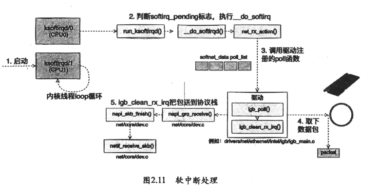

```
static int ksoftirqd_should_run(unsigned int cpu)
{
	return local_softirq_pending();
}
```

这段代码定义了一个名为 `ksoftirqd_should_run` 的函数，该函数用于确定是否应该在特定 CPU 上运行 ksoftirqd 线程。以下是这段代码的详细解释：

- `static int ksoftirqd_should_run(unsigned int cpu)`：这是函数的声明，它接受一个参数 `cpu`，表示特定的 CPU。
- `local_softirq_pending()`：这是一个函数调用，它用于检查本地软中断是否处于挂起状态。`local_softirq_pending()` 函数通常会检查特定 CPU 上是否有软中断处于挂起状态。
- `return local_softirq_pending();`：这行代码返回 `local_softirq_pending()` 函数的结果。如果在特定 CPU 上有软中断处于挂起状态，那么函数返回 `1`，否则返回 `0`。

总结来说，这段代码的目的是检查特定 CPU 上是否有软中断处于挂起状态。如果有软中断挂起，那么函数返回 `1`，表示 ksoftirqd 线程应该在该 CPU 上运行以处理挂起的软中断。这有助于确保及时处理软中断事件，并优化系统的性能。通常，ksoftirqd 线程负责处理软中断，以减轻内核的中断处理负载，这里与硬中断用了同一个函数local_softirq_pending，不同的是：硬中断是为了写入标记，软中断只是读取，若硬中断中设置了NET_RX_SOFTIRQ，软中断就可以读取到。接下来会真正进入内核线程处理函数run_ksoftirqd进行处理。

```
static void run_ksoftirqd(unsigned int cpu)
{
    // 调用 ksoftirqd_run_begin() 函数，用于标记软中断守护线程的运行开始。
    ksoftirqd_run_begin();

    // 检查本地 CPU 上是否有软中断挂起（local_softirq_pending() 函数）。
    if (local_softirq_pending()) {
        /*
         * 我们可以安全地在内联堆栈上运行软中断，因为我们不会深入到任务堆栈中。
         */
        // 如果有软中断挂起，调用 __do_softirq() 函数来执行软中断处理。
        __do_softirq();

        // 调用 ksoftirqd_run_end() 函数，标记软中断守护线程的运行结束。
        ksoftirqd_run_end();

        // 调用 cond_resched() 函数，进行条件性的调度。这可能会让 CPU 调度器考虑是否需要切换到其他任务。
        cond_resched();
        return;
    }

    // 如果没有软中断挂起，则调用 ksoftirqd_run_end() 函数，标记软中断守护线程的运行结束。
    ksoftirqd_run_end();
}

```

```
asmlinkage __visible void do_softirq(void)
{
    __u32 pending;
    unsigned long flags;

    // 如果当前上下文已经在中断处理中，则直接返回，避免重复进入中断处理。
    if (in_interrupt())
        return;

    // 保存当前 CPU 的中断标志位，并将中断禁用（关中断）。
    local_irq_save(flags);

    // 检查本地 CPU 上是否有软中断挂起（local_softirq_pending() 函数）。
    pending = local_softirq_pending();

    // 如果有软中断挂起，则调用 do_softirq_own_stack() 函数，执行软中断的实际处理。
    if (pending)
        do_softirq_own_stack();

    // 恢复之前保存的中断标志位，允许中断再次被触发。
    local_irq_restore(flags);
}

```

```
restart:
	/* 重置挂起的软中断位掩码 */
	set_softirq_pending(0);

	/* 启用本地中断 */
	local_irq_enable();

	h = softirq_vec;

	/* 循环处理挂起的软中断 */
	while ((softirq_bit = ffs(pending))) {
		unsigned int vec_nr;
		int prev_count;

		/* 更新处理的软中断索引 */
		h += softirq_bit - 1;

		vec_nr = h - softirq_vec;
		prev_count = preempt_count();

		/* 增加与当前软中断相关的统计数据 */
		kstat_incr_softirqs_this_cpu(vec_nr);

		/* 调用软中断处理函数 */
		trace_softirq_entry(vec_nr);
		h->action(h);
		trace_softirq_exit(vec_nr);

		/* 检查软中断处理前后的 preemption count 是否一致 */
		if (unlikely(prev_count != preempt_count())) {
			pr_err("huh, entered softirq %u %s %p with preempt_count %08x, exited with %08x?\n",
			       vec_nr, softirq_to_name[vec_nr], h->action,
			       prev_count, preempt_count());
			preempt_count_set(prev_count);
		}

		/* 移动到下一个软中断处理函数 */
		h++;
		pending >>= softirq_bit;
	}

```

这段代码的主要作用是处理软中断队列中挂起的软中断。具体操作包括：

1. 通过 `set_softirq_pending(0)` 重置挂起的软中断位掩码，以准备处理新的软中断。
2. 使用 `local_irq_enable()` 启用本地中断，允许中断触发。
3. 进入一个循环，处理挂起的软中断。循环通过 `ffs(pending)` 来查找挂起的软中断位，并逐个处理。
4. 在循环内部，首先更新要处理的软中断的索引 `vec_nr` 和保存进入软中断处理前的 preemption count。
5. 调用软中断处理函数 `h->action(h)` 来执行软中断的实际处理。
6. 在软中断处理前后，检查 preemption count 是否一致。如果不一致，会输出一条错误消息，并尝试恢复 preemption count。
7. 移动到下一个待处理的软中断，继续处理，直到没有挂起的软中断为止。

总之，这段代码是用于处理 Linux 内核中软中断队列中挂起的软中断的核心逻辑，确保软中断按照优先级依次得到处理。软中断通常用于处理低优先级的后台任务，以免阻塞高优先级的硬中断。


硬中断中的设置软中断标记，和ksoftirqd中的判断是否有软中断到达都是基于smp_processor_id()的，这表示只要硬中断在哪个CPU上被响应，那么软中断也是在这个CPU上处理的。所有若linux软中断的CPU消耗都集中在一个核，正确的做法是调整硬中断的CPU亲和性，将硬中断打散到不同的CPU核上。

```
static __latent_entropy void net_rx_action(struct softirq_action *h)
{
	struct softnet_data *sd = this_cpu_ptr(&softnet_data);
	unsigned long time_limit = jiffies +
		usecs_to_jiffies(READ_ONCE(netdev_budget_usecs));
	int budget = READ_ONCE(netdev_budget);
	LIST_HEAD(list);
	LIST_HEAD(repoll);

start:
	sd->in_net_rx_action = true;
	local_irq_disable();
	list_splice_init(&sd->poll_list, &list);
	local_irq_enable();

	
```

这段代码是Linux内核中网络接收（RX）软中断的核心处理函数。让我为您逐行解释它的关键部分：

1. `struct softnet_data *sd = this_cpu_ptr(&softnet_data);`: 这行代码获取了指向当前CPU上 `softnet_data` 结构的指针，`softnet_data` 用于跟踪网络接收相关的信息。
2. `unsigned long time_limit = jiffies + usecs_to_jiffies(READ_ONCE(netdev_budget_usecs));`: 这行代码计算了一个时间限制 `time_limit`，其值是当前 jiffies（内核时间单位）加上从 `netdev_budget_usecs` 变量中读取的微秒数转换而来的 jiffies。这个时间限制可能用于限制网络接收处理的时间。
3. `int budget = READ_ONCE(netdev_budget);`: 这行代码读取了 `netdev_budget` 变量的值，该变量可能表示了网络接收的预算或允许的处理数量。
4. `LIST_HEAD(list);` 和 `LIST_HEAD(repoll);`: 这两行代码定义了两个链表头，用于存储待处理的网络数据包以及需要重新进行轮询的网络数据包。重新处理的数据包队列通常用于处理在首次处理期间发生异常或无法立即成功处理的数据包。
5. `sd->in_net_rx_action = true;`：设置一个标志，表示当前正在处理接收数据包的软中断。这个标志可能用于在处理过程中协调其他操作。
6. `local_irq_disable();`：禁用本地中断，确保在处理接收数据包期间不会被中断。这是为了保证处理的原子性，以避免并发问题。
7. `list_splice_init(&sd->poll_list, &list);`：这一行代码将一个链表（`sd->poll_list`）的内容添加到另一个链表（`list`）中，并且初始化源链表（`sd->poll_list`）为空。这可能表示正在将待处理的数据包从一个列表移到另一个列表，以便后续的处理。
8. `local_irq_enable();`：重新启用本地中断，允许中断再次发生。

这段代码的目的是在确保数据包处理的原子性的同时，将待处理的数据包从一个链表移到另一个链表。这可能是为了提高处理效率或进行后续的处理步骤。在网络子系统中，软中断通常用于异步处理接收的数据包，以减小中断负载并提高性能。

```
for (;;) {
		struct napi_struct *n;

		skb_defer_free_flush(sd);

		if (list_empty(&list)) {
			if (list_empty(&repoll)) {
				sd->in_net_rx_action = false;
				barrier();
				/* We need to check if ____napi_schedule()
				 * had refilled poll_list while
				 * sd->in_net_rx_action was true.
				 */
				if (!list_empty(&sd->poll_list))
					goto start;
				if (!sd_has_rps_ipi_waiting(sd))
					goto end;
			}
			break;
		}

```

1. `struct napi_struct *n;`：定义了一个指向`napi_struct`结构体的指针`n`，该结构体通常用于网络中断处理。这个指针可能用于迭代处理不同的NAPI对象。
2. `skb_defer_free_flush(sd);`：这可能是在处理数据包之前执行的某种操作，通常是为了刷新推迟释放（deferred free）的套接字缓冲（socket buffer）。
3. `if (list_empty(&list)) {`：检查名为`list`的链表是否为空。`list`可能包含等待处理的数据包。
4. `if (list_empty(&repoll)) {`：检查名为`repoll`的链表是否为空。`repoll`可能包含需要重新轮询的数据包。
5. `sd->in_net_rx_action = false;`：将处理接收数据包的软中断标志设置为false，表示不再处理数据包。
6. `barrier();`：这里使用了一个内存屏障（barrier），可能用于确保在标志被设置为false后，对其他共享数据的操作都已完成。内存屏障用于控制编译器和处理器的内存访问顺序，以确保多线程操作的一致性。
7. `if (!list_empty(&sd->poll_list))`：检查名为`sd->poll_list`的链表是否非空。如果在设置标志为false后，有新的数据包被添加到了`sd->poll_list`中，那么会跳转到`start`标签，重新开始处理数据包。
8. `if (!sd_has_rps_ipi_waiting(sd))`：检查是否有RPS（Receive Packet Steering） IPI（Inter-Processor Interrupt）等待。RPS通常用于在多核系统中分发网络接收处理的负载。如果没有等待的情况，会跳转到`end`标签，退出处理循环。
9. RPS（Receive Packet Steering）：
   - RPS是一种技术，用于将接收到的网络数据包从一个CPU核心传输到另一个CPU核心以进行进一步处理。在多核处理器系统中，通常有多个CPU核心，每个核心可能独立处理网络数据包。
   - RPS的主要目的是在多核系统中更均匀地分布网络数据包处理的负载，以提高系统的网络性能。它可以避免某个核心过载，而其他核心处于空闲状态的情况。
   - 当一个CPU核心接收到数据包后，RPS会将数据包的处理委托给其他核心。这通常涉及到将数据包相关的中断（例如，软中断）传递给目标核心。
10. IPI（Inter-Processor Interrupt）：
    - IPI是一种用于在多核处理器系统中进行处理器间通信的机制。它允许一个CPU核心向另一个核心发送中断请求，以触发某种操作。
    - 在上下文中，RPS通常涉及使用IPI来通知目标核心需要处理特定的网络数据包。目标核心在接收到IPI后，会相应地处理数据包，以协调负载均衡。

综合起来，RPS和IPI通常一起使用，以确保在多核系统中高效地处理网络数据包。RPS用于分发数据包的负载，而IPI用于触发处理数据包的操作。这些技术有助于提高多核系统的网络性能和资源利用率

总体来说，这段代码片段的目的是在循环中处理接收的数据包，同时检查是否有新的数据包需要处理或是否有RPS等待。如果没有待处理的数据包并且没有RPS等待，循环将退出，结束软中断处理。如果有新的数据包或RPS等待，循环将继续处理。

```
	local_irq_disable();

	list_splice_tail_init(&sd->poll_list, &list);
	list_splice_tail(&repoll, &list);
	list_splice(&list, &sd->poll_list);
	if (!list_empty(&sd->poll_list))
		__raise_softirq_irqoff(NET_RX_SOFTIRQ);
	else
		sd->in_net_rx_action = false;

	net_rps_action_and_irq_enable(sd);
end:;
```

1. `local_irq_disable();`：这里禁用了本地CPU核心的硬中断。这是为了确保在处理网络数据包时不会被其他硬中断中断，从而保持数据包处理的一致性和完整性。
2. `list_splice_tail_init(&sd->poll_list, &list);`：这一行代码将两个链表进行连接。`sd->poll_list` 是一个链表，其中存储了待处理的网络数据包的 NAPI 结构。`list` 是一个临时链表，用于存储需要重新处理的数据包。`list_splice_tail_init()`函数将`sd->poll_list` 中的元素移到 `list` 中，并初始化 `sd->poll_list` 为空链表。
3. `list_splice_tail(&repoll, &list);`：这一行代码将另一个链表 `repoll` 的元素添加到 `list` 的尾部。`repoll` 是一个用于存储需要重新处理的数据包的链表。
4. `list_splice(&list, &sd->poll_list);`：这一行代码将 `list` 中的元素合并到 `sd->poll_list` 中，以便进一步处理。现在，`sd->poll_list` 包含了所有需要处理的数据包。
5. `if (!list_empty(&sd->poll_list))`：这个条件语句检查 `sd->poll_list` 是否为空。如果其中有未处理的数据包，就执行下面的操作。
6. `__raise_softirq_irqoff(NET_RX_SOFTIRQ);`：这行代码触发一个软中断，其中 `NET_RX_SOFTIRQ` 表示网络接收软中断。这将启动网络数据包的处理。
7. `else`：如果 `sd->poll_list` 为空，表示没有未处理的数据包。
8. `sd->in_net_rx_action = false;`：这一行将 `sd->in_net_rx_action` 设置为 `false`，表示当前CPU核心不再处于网络数据包接收处理的状态。
9. `net_rps_action_and_irq_enable(sd);`：这一行代码用于启用网络数据包接收处理的远程处理（RPS）。它可能涉及到向其他CPU核心发送中断请求，以便它们也可以处理网络数据包。
10. `end:;`：这是一个标签，标识了代码块的结束。在这里，它没有具体的作用，只是用来标记代码块的结束。

总之，这段代码通过合并链表、触发软中断以及启用远程处理来协调网络数据包的处理，以确保数据包在多核系统中得到高效处理。

需要注意的是硬中断将设备添加到poll_list不会重复添加，在软中断处理函数net_rx_action这里一进来就调用local_irq_disable把所有的硬中断都关了，time_limit和budget是用来控制net_rx_action函数主动退出的，确保网络包的接收不霸占CPU不放。

```
static int igb_poll(struct napi_struct *napi, int budget)
{
	struct igb_q_vector *q_vector = container_of(napi,
						     struct igb_q_vector,
						     napi);
	bool clean_complete = true;
	int work_done = 0;

#ifdef CONFIG_IGB_DCA
	if (q_vector->adapter->flags & IGB_FLAG_DCA_ENABLED)
		igb_update_dca(q_vector);
#endif
	if (q_vector->tx.ring)
		clean_complete = igb_clean_tx_irq(q_vector, budget);

	if (q_vector->rx.ring) {
		int cleaned = igb_clean_rx_irq(q_vector, budget);

		work_done += cleaned;
		if (cleaned >= budget)
			clean_complete = false;
	}

	/* If all work not completed, return budget and keep polling */
	if (!clean_complete)
		return budget;

	/* Exit the polling mode, but don't re-enable interrupts if stack might
	 * poll us due to busy-polling
	 */
	if (likely(napi_complete_done(napi, work_done)))
		igb_ring_irq_enable(q_vector);

	return work_done;
}
```

这段代码片段出现在一个网络数据包接收处理的软中断函数中，它的目的是协调网络数据包的处理，确保数据包在多核系统中得到高效处理。下面是对这段代码的逐行解释：

1. `local_irq_disable();`：
   - 这里禁用了本地CPU核心的硬中断。这是为了确保在处理网络数据包时不会被其他硬中断中断，从而保持数据包处理的一致性和完整性。
2. `list_splice_tail_init(&sd->poll_list, &list);`：
   - 这一行代码将两个链表进行连接。`sd->poll_list` 是一个链表，其中存储了待处理的网络数据包的 NAPI 结构。`list` 是一个临时链表，用于存储需要重新处理的数据包。
   - `list_splice_tail_init()` 函数将 `sd->poll_list` 中的元素移到 `list` 中，并初始化 `sd->poll_list` 为空链表。
3. `list_splice_tail(&repoll, &list);`：
   - 这一行代码将另一个链表 `repoll` 的元素添加到 `list` 的尾部。`repoll` 是一个用于存储需要重新处理的数据包的链表。
4. `list_splice(&list, &sd->poll_list);`：
   - 这一行代码将 `list` 中的元素合并到 `sd->poll_list` 中，以便进一步处理。现在，`sd->poll_list` 包含了所有需要处理的数据包。
5. `if (!list_empty(&sd->poll_list))`：
   - 这个条件语句检查 `sd->poll_list` 是否为空。如果其中有未处理的数据包，就执行下面的操作。
6. `__raise_softirq_irqoff(NET_RX_SOFTIRQ);`：
   - 这行代码触发一个软中断，其中 `NET_RX_SOFTIRQ` 表示网络接收软中断。这将启动网络数据包的处理。
7. `else`：
   - 如果 `sd->poll_list` 为空，表示没有未处理的数据包。
8. `sd->in_net_rx_action = false;`：
   - 这一行将 `sd->in_net_rx_action` 设置为 `false`，表示当前CPU核心不再处于网络数据包接收处理的状态。
9. `net_rps_action_and_irq_enable(sd);`：
   - 这一行代码用于启用网络数据包接收处理的远程处理（RPS）。它可能涉及到向其他CPU核心发送中断请求，以便它们也可以处理网络数据包。
10. `end:;`：
    - 这是一个标签，标识了代码块的结束。在这里，它没有具体的作用，只是用来标记代码块的结束。

总之，这段代码通过合并链表、触发软中断以及启用远程处理来协调网络数据包的处理，以确保数据包在多核系统中得到高效处理。


```
static int igb_poll(struct napi_struct *napi, int budget)
{
	struct igb_q_vector *q_vector = container_of(napi,
						     struct igb_q_vector,
						     napi);
		
	bool clean_complete = true;
	int work_done = 0;

#ifdef CONFIG_IGB_DCA
	if (q_vector->adapter->flags & IGB_FLAG_DCA_ENABLED)
		igb_update_dca(q_vector);
#endif
	if (q_vector->tx.ring)
		clean_complete = igb_clean_tx_irq(q_vector, budget);

	if (q_vector->rx.ring) {
		int cleaned = igb_clean_rx_irq(q_vector, budget);

		work_done += cleaned;
		if (cleaned >= budget)
			clean_complete = false;
	}

	/* If all work not completed, return budget and keep polling */
	if (!clean_complete)
		return budget;

	/* Exit the polling mode, but don't re-enable interrupts if stack might
	 * poll us due to busy-polling
	 */
	if (likely(napi_complete_done(napi, work_done)))
		igb_ring_irq_enable(q_vector);

	return work_done;
}

```

这段代码是一个网络设备驱动程序中的 `igb_poll` 函数。以下是对代码的逐行解释：

1. `struct igb_q_vector *q_vector = container_of(napi, struct igb_q_vector, napi);`：这行代码通过 `container_of` 宏将 `napi_struct` 结构体指针 `napi` 转换为 `igb_q_vector` 结构体指针 `q_vector`。这里假设 `napi` 结构体是作为 `igb_q_vector` 结构体的一部分来使用的。
2. `bool clean_complete = true;`：
   - 这行代码定义了一个布尔变量 `clean_complete`，并将其初始化为 `true`。
3. `int work_done = 0;`：
   - 这行代码定义了一个整数变量 `work_done`，并将其初始化为 `0`。
4. `#ifdef CONFIG_IGB_DCA` 和 `#endif`：
   - 这是一个条件编译块，用于检查是否定义了 `CONFIG_IGB_DCA`。如果定义了，那么代码块内的内容将包含在编译中，否则将被忽略。
5. `if (q_vector->adapter->flags & IGB_FLAG_DCA_ENABLED)`：
   - 这个条件语句检查网卡适配器结构体中的标志 `IGB_FLAG_DCA_ENABLED` 是否已设置。如果已设置，表示使用了 Direct Cache Access (DCA) 特性，将调用 `igb_update_dca` 函数来更新 DCA 相关的设置。
6. `if (q_vector->tx.ring)`：
   - 这个条件语句检查是否存在传输（TX）环（ring）。如果存在，将调用 `igb_clean_tx_irq` 函数来处理传输中断。
7. `if (q_vector->rx.ring)`：
   - 这个条件语句检查是否存在接收（RX）环（ring）。如果存在，将调用 `igb_clean_rx_irq` 函数来处理接收中断，并将处理的结果累加到 `work_done` 中。
8. `if (!clean_complete)`：
   - 这个条件语句检查是否所有的清理工作已经完成。如果没有，将返回 `budget`（传递的处理预算），并保持轮询状态。
9. `if (likely(napi_complete_done(napi, work_done)))`：
   - 这个条件语句检查是否可以完成 NAPI（New API）处理。如果可以，表示所有工作都已完成，将通过 `igb_ring_irq_enable` 函数重新启用中断。

最终，这段代码执行了网络设备的轮询操作，清理传输和接收中断，确保网络数据包的处理工作。如果还有工作未完成，将保持轮询状态，否则将重新启用中断。这是一个典型的网络设备驱动程序中的轮询处理函数。
