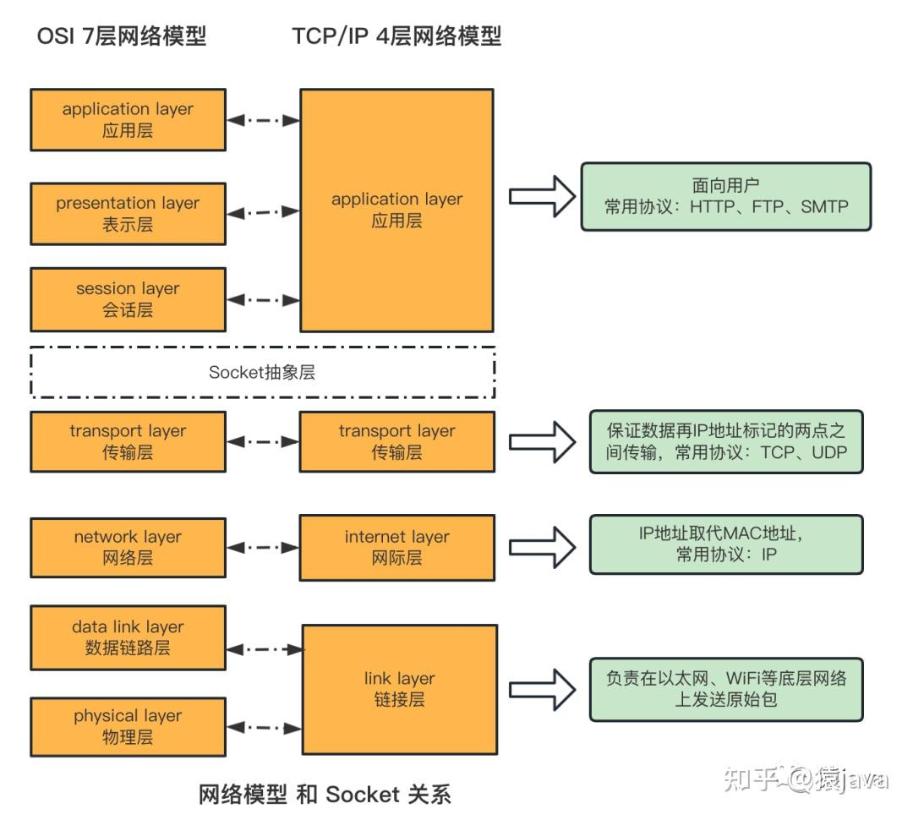
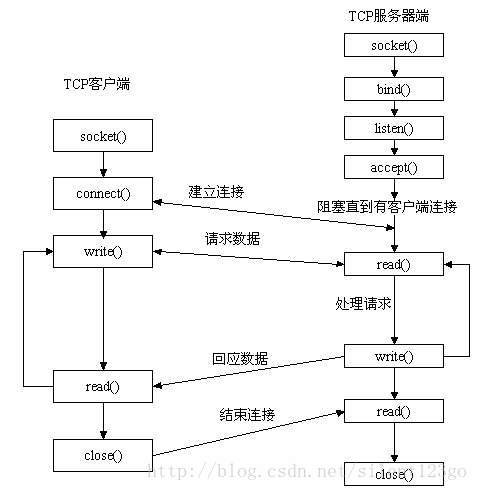

Socket编程是一种用于网络通信的编程方式，它允许计算机程序通过网络进行数据交换。在Socket编程中，通信的两端分别运行在不同的计算机上，它们可以通过网络互相发送和接收数据。Socket编程通常用于构建客户端-服务器应用程序，其中客户端和服务器之间通过Socket建立连接，实现数据交换。

### Socket基本概念

#### 套接字

套接字是一种抽象的端点，用于发送和接受数据。独立于协议的网络编程接口，对网络中不同主机上的应用进程之间进行双向通信的端点。



#### socket编程流程



服务器段先初始化Socket，然后与端口绑定（bind），对端口进行监听（listen），调用accept阻塞，等待客户端连接，这时如果有个客户端初始化一个Socket，然后连接服务器（connect），这时客户端与服务器端的连接就建立了。客户端发送数据请求，服务器端接受请求并处理请求，然后把回应数据发送给客户端，客户端读取数据，最后关闭连接，一次交互完成。

#### 相关函数

##### socket()

```
int socket(int domain, int type, int protocol)
```

domain:协议域，常用的协议族有，AF_INET、AF_INET6、AF_LOCAL（或称AF_UNIX，Unix域socket）、AF_ROUTE等等。协议族决定了socket的地址类型，在通信中必须采用对应的地址，如AF_INET决定了要用ipv4地址（32位的）与端口号（16位的）的组合、AF_UNIX决定了要用一个绝对路径名作为地址。

type:指定socket类型，常用的socket类型有，SOCK_STREAM、SOCK_DGRAM、SOCK_RAW、SOCK_PACKET、SOCK_SEQPACKET等等。

protocol：指定协议，常用的协议有，IPPROTO_TCP、IPPTOTO_UDP、IPPROTO_SCTP、IPPROTO_TIPC等，它们分别对应TCP传输协议、UDP传输协议、STCP传输协议、TIPC传输协议。

注意：并不是上面的type和protocol可以随意组合的，如SOCK_STREAM不可以跟IPPROTO_UDP组合。当protocol为0时，会自动选择type类型对应的默认协议。


当我们调用socket创建一个socket时，返回的socket描述字它存在于协议族（address family，AF_XXX）空间中，但没有一个具体的地址。如果想要给它赋值一个地址，就必须调用bind()函数，否则就当调用connect()、listen()时系统会自动随机分配一个端口。

##### bind()

```
int bind(int sockfd, const struct sockaddr *addr, socklen_t addrlen);
```

sockfd:即socket描述字，唯一标识一个socket，bind()函数是将给这个描述字绑定一个名字。

addr:一个const struct sockaddr *指针，指向要绑定给sockfd的协议地址。

addrlen:对应是地址的长度。

通常服务器在启动的时候会绑定一个地址（如ip+端口号），用于提供服务，客户就可以通过它来连接服务器；而客户端就不用指定，系统自动分配一个端口号和自身的ip地址组合，所以通常服务器端在listen之前会调用bind()，而客户端就不会调用，而是在connect()时由系统随机生成一个。

注：在将一个地址绑定到socket的时候，需要先将主机字节序转换成为网络字节序。

##### listen(),connect()函数

如果作为一个服务器，在调用socket(),bind()之后就会调用listen()来监听，如果客户端这时调用connect()发出连接请求，服务器端就会接收到这个请求。

```
int listen(int sockfd, int backlog);
int connect(int sockfd, const struct sockaddr *addr, socklen_t addrlen)
```

backlog:相应socket可以排队的最大连接个数。

socket()函数创建的socket默认是一个主动类型的，listen函数将socket变为被动类型，等待客户的连接请求。

connect的*addr为服务器的socket地址，addrlen为socket地址的长度。

客户端通过调用connect函数来建立与tcp服务器的连接。

##### accept()函数

TCP服务器端依次调用socket(),bind(),listen()后，就会监听指定的socket地址，TCP客户端依次调用socket(),connect()之后就向TCP服务器发送一个连接请求。TCP服务器监听到这个请求后，就会调用accept()函数取接受请求，这样连接就建立好了。之后就可以开始网络I/O操作了，即类同于普通文件的读写I/O操作。

```
int accept(int sockfd, struct sockaddr *addr, socklen_t *addrlen)
```

*addr:返回客户端的协议地址

*addrlen:协议地址的长度

如果accpet成功，那么其返回值是由内核自动生成的一个全新的描述字，代表与返回客户的TCP连接。

##### read(),write()等函数

网络I/O操作有下面几组：

```
read()/write()
recv()/send()
readv()/writev()
recvmsg()/sendmsg()
recvfrom()/sendto()
```

最通用的是

recvmsg()/sendmsg()函数

read函数是负责从fd中读取内容.当读成功时，read返回实际所读的字节数，如果返回的值是0表示已经读到文件的结束了，小于0表示出现了错误。如果错误为EINTR说明读是由中断引起的，如果是ECONNREST表示网络连接出了问题。

write函数将buf中的nbytes字节内容写入文件描述符fd.成功时返回写的字节数。失败时返回-1，并设置errno变量。 在网络程序中，当我们向套接字文件描述符写时有俩种可能。1)write的返回值大于0，表示写了部分或者是全部的数据。2)返回的值小于0，此时出现了错误。我们要根据错误类型来处理。如果错误为EINTR表示在写的时候出现了中断错误。如果为EPIPE表示网络连接出现了问题(对方已经关闭了连接)。

```
ssize_t recv(int sockfd, void *buf, size_t len, int flags);

```

- `sockfd`：套接字文件描述符，指定要接收数据的套接字。
- `buf`：用于接收数据的缓冲区。
- `len`：要接收的最大字节数。
- `flags`：通常为0，表示没有特殊标志

##### close()函数

在服务器与客户端建立连接之后，会进行一些读写操作，完成了读写操作就要关闭相应的socket描述字，好比操作完打开的文件要调用fclose关闭打开的文件。

```
#include <unistd.h>int close(int fd);
```

close一个TCP socket的缺省行为时把该socket标记为以关闭，然后立即返回到调用进程。该描述字不能再由调用进程使用，也就是说不能再作为read或write的第一个参数。

注意：close操作只是使相应socket描述字的引用计数-1，只有当引用计数为0的时候，才会触发TCP客户端向服务器发送终止连接请求。
