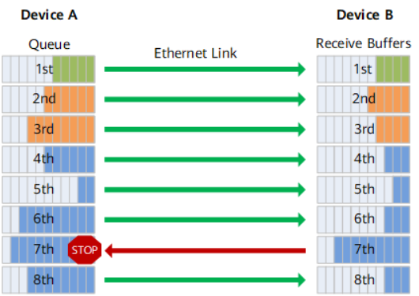
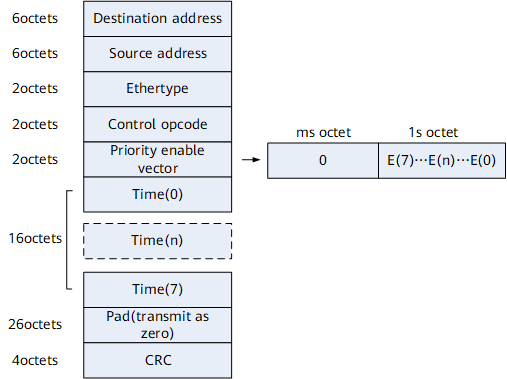
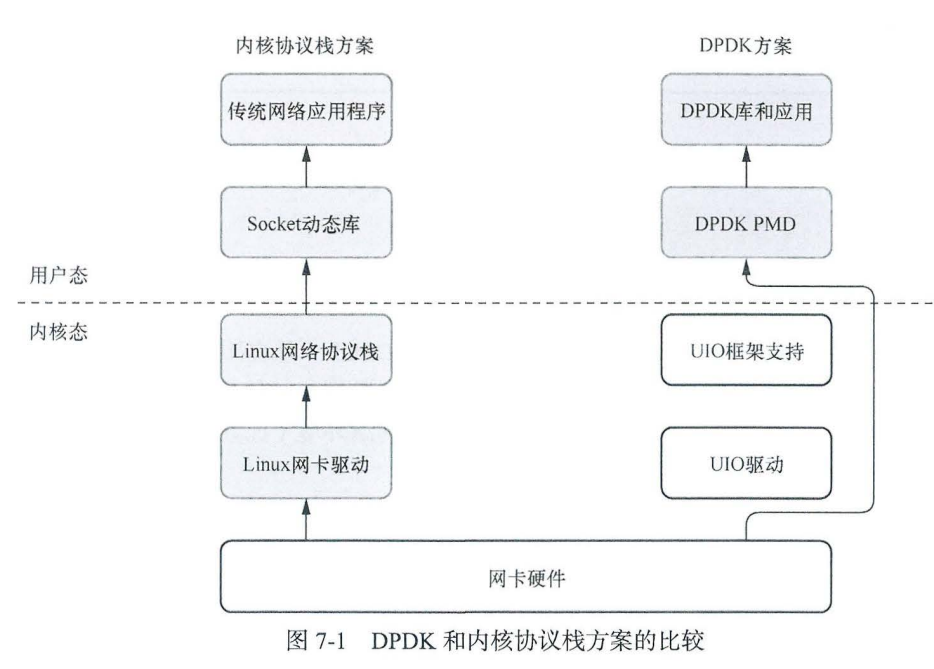

### PFC优先级流量控制

PFC（Priority-based Flow Control，基于优先级的流量控制）也称为Per Priority Pause或 CBFC（Class Based Flow Control），是对Pause机制的一种增强。当前以太Pause机制（IEEE 802.3 Annex 31B）也能达到无丢包的要求，原理如下：当下游设备发现接收能力小于上游设备的发送能力时，会主动发Pause帧给上游设备，要求暂停流量的发送，等待一定时间后再继续发送数据。但是以太Pause机制的流量暂停是针对整个接口，即在出现拥塞时会将链路上所有的流量都暂停。

而PFC允许在一条以太网链路上创建8个虚拟通道，并为每条虚拟通道指定一个优先等级，允许单独暂停和重启其中任意一条虚拟通道，同时允许其它虚拟通道的流量无中断通过。这一方法使网络能够为单个虚拟链路创建无丢包类别的服务，使其能够与同一接口上的其它流量类型共存。

如图所示，DeviceA发送接口分成了8个优先级队列，DeviceB接收接口有8个接收缓存（buffer），两者一一对应（报文优先级和接口队列存在着一一对应的映射关系），形成了网络中 8 个虚拟化通道，缓存大小不同使得各队列有不同的数据缓存能力。

当DeviceB的接口上某个接收缓存产生拥塞时，即某个设备的队列缓存消耗较快，超过一定阈值（可设定为端口队列缓存的 1/2、3/4 等比例），DeviceB即向数据进入的方向（上游设备DeviceA）发送反压信号“STOP”。

DeviceA接收到反压信号，会根据反压信号指示停止发送对应优先级队列的报文，并将数据存储在本地接口缓存。如果DeviceA本地接口缓存消耗超过阈值，则继续向上游反压，如此一级级反压，直到网络终端设备，从而消除网络节点因拥塞造成的丢包。

参考https://support.huawei.com/enterprise/zh/doc/EDOC1100075566/d1e17776

“反压信号”实际上是一个以太帧，其具体报文格式如图所示

|  Destination address   | 目的MAC地址，取值固定为01-80-c2-00-00-01。                   |
| :--------------------: | ------------------------------------------------------------ |
|     Source address     | 源MAC地址。                                                  |
|       Ethertype        | 以太网帧类型，取值为88-08。                                  |
|     Control opcode     | 控制码，取值为01-01。                                        |
| Priority enable vector | 反压使能向量。其中E(n)和优先级队列n对应，表示优先级队列n是否需要反压。当E(n)=1时，表示优先级队列n需要反压，反压时间为Time(n)；当E(n)=0时，则表示该优先级队列不需要反压。 |
|    Time(0)～Time(7)    | 反压定时器。当Time(n)=0时表示取消反压。                      |
|          Pad           | 预留。传输时为0。                                            |
|          CRC           | 循环冗余校验。                                               |

总而言之，设备会为端口上的8个队列设置各自的PFC门限值，当队列已使用的缓存超过PFC门限值时，则向上游发送PFC反压通知报文，通知上游设备停止发包；当队列已使用的缓存降低到PFC门限值以下时，则向上游发送PFC反压停止报文，通知上游设备重新发包，从而最终实现报文的无丢包传输。

由此可见，PFC中流量暂停只针对某一个或几个优先级队列，不针对整个接口进行中断，每个队列都能单独进行暂停或重启，而不影响其他队列上的流量，真正实现多种流量共享链路。而对非PFC控制的优先级队列，系统则不进行反压处理，即在发生拥塞时将直接丢弃报文。

但是网络中如果出现大量PFC反压帧，则极有可能诱发网络死锁，出现两个或多个队列发生永久堵塞（等待），每个队列都在等待被其他队列占用并堵塞了的资源，最终导致网络系统性风险。智能无损网络提供了PFC死锁检测功能。当设备在死锁检测周期内持续收到反压帧时，将不会响应，确保不出现PFC死锁情况。

#### 哈希

哈希（Hash）是一种将任意大小的数据映射到固定大小值的过程。这个固定大小的值通常称为哈希值或哈希码。哈希函数是执行哈希操作的算法或函数。

哈希函数的主要特点包括：

1. **固定输出长度**：哈希函数将输入数据映射为固定长度的哈希值。无论输入数据的大小如何，哈希值的长度始终保持不变。
2. **相同输入产生相同哈希值**：对于相同的输入数据，哈希函数始终生成相同的哈希值。这是哈希函数的一致性特性。
3. **不同输入尽量生成不同的哈希值**：好的哈希函数会尽量确保不同的输入数据映射为不同的哈希值，以减少哈希冲突的概率。

### DPDK

#### 为什么有dpdk

以 Linux 内核协议栈为基础的网络方案存在许多瓶颈，无法高性能地处理数据包

此时需要 个解决方案来消除这些瓶颈，同时保持与原有 Linux 应用程序的兼容 另外，新方案还应该适合以库的形式打包到 Linux 发行版中，在用户需要时用来管理各种网络设备这些目标最初是在 2010 年实现的，当时 Intel 基于 Nehalem 微架构的 Xeon 处理器推出了 DPDK的初始版本 DPDK 绕过 (bypass) Linux 内核，在用户态执行数据包处理 以提供尽可能高的网络性能。DPDK 程序运行在操作系统的用户态，利用自带的“数据平面库”进行数据包的发送、处理和接收，绕过了运行在内核态的 Linux 网络协议栈，提升了数据包处理效率展示DPDK 在软件架构上与内核协议栈方案的差异。

​         不过， Linux 内核仍然是 DPDK 实现的基础，比如内核中的 UIO 驱动框架，它为 DPDK驱动程序提供了获取寄存器地址和长度、地址映射和读取中断计数等功能（具体如何以及是否使用这些功能，还要看 DPDK 驱动程序的具体实现）。另外，内核提供的“大页“机制也DPDK 进行内存管理的重要手段

​        DPDK 的网卡驱动程序运行在用户态 其屏蔽了网卡硬件发起的大部分（除了断链、错误等类型的）中断，采用主动轮询的模式，待续检查网卡的接收／发送队列，查看是否有新数据到达或者是否可以继续发送数据，从而实现高吞吐械和低时延 因此， DPDK 的驱动程序被称为轮询模式驱动程序 (poll mode driver, PMD)

#### DPDK体系结构

​        DPDK 为需要快速处理数据包的数据平面应用提供了一个简单、完整的框架。该框架通过创建环境抽象层 (envonment abstraction layer, EAL) ，为特定环境提供组库这里提到的特定环境，指的是 CPU 体系结构（比如 32 位或 64 x86 处理器）、 GCC 编译器或某些特定的平台这些环境通过使用 meson 文件和配置文件来指定。一旦创建了EAL 库，用户就可以与该库链接以执行自己的应用程序 DPDK 也提供了EAL 之外的其他库，比如哈希(hash) 、最长前缀匹配 (LPM) 库等 此外， DPDK 代码中的示例应用程序可以帮助用户了解如何使用 DPDK 提供的各种功能。

​       DPDK 为处理数据包实现了一个“运行到完成 “(run to completion) 的模型，在执行数据平面处理逻辑之前，必须先分配所有资源，然后以逻辑核上执行单元（线程）的形式运行该模型不支持调度器，以轮询的方式访问所有设备处理数据包时不使用中断，主要原因是中断处理会产生较大的性能开销。

##### 核心组件

