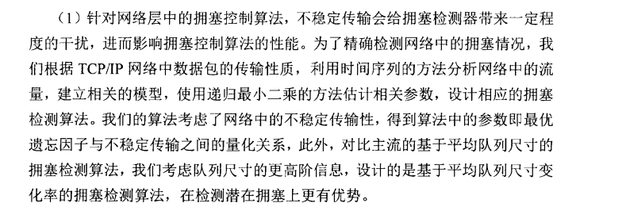

### 边缘算力网络拥塞控制检测算法的研究

边缘算力：摄像头，传感器，雷达等机载场景

网络协议：TCP/UDP/RDMA

编程语言：socket，verbs

性能指标：吞吐量，时延，丢包，公平性等等（还有很多）

设计一种有效的边缘算力网络拥塞控制性能测试方法，实现网络拥塞问题的准确诊断（与性能优化）

网络拥塞的状态无限多，最终实现测试方法通用

性能优化：在测试到什么情况下使用哪种网络拥塞算法（这里还不能明确有没有可实施性）

边缘算力网络（Edge Computing Network）是一种新型的计算网络架构，它将计算和数据存储功能从传统的集中式云计算数据中心移至接近数据源的边缘位置。这种网络架构的目的是在物联网、5G通信等应用场景中降低延迟、提高带宽利用率、增加网络安全性，并且能够更好地支持大规模设备和传感器的连接。

在边缘算力网络中，计算和数据处理通常发生在离数据源（例如传感器、摄像头、用户设备等）更近的地方，而不是在远离数据源的集中式云服务器上。这样做的好处包括：

1. **低延迟：** 数据和计算在边缘位置处理，减少了数据传输到云服务器和返回的时间，从而降低了延迟。
2. **带宽利用率：** 边缘计算可以在本地处理数据，只有需要时才将必要的结果传输到云端，节约了网络带宽。
3. **隐私和安全性：** 一些敏感数据可以在本地处理，而不必在网络上传输，提高了数据的隐私和安全性。
4. **支持大规模设备连接：** 边缘计算网络可以更好地支持大规模的物联网设备和传感器的连接，因为数据处理分布在网络的各个边缘节点上。
5. **灵活性：** 边缘计算可以根据具体应用场景定制处理逻辑，提供更灵活的计算和存储解决方案。

边缘算力网络通常由边缘节点（Edge Nodes）组成，这些节点可以是物理服务器、路由器、交换机、甚至是智能设备。这些节点具有一定的计算和存储能力，能够执行应用程序、存储数据，并在需要时与其他节点通信。

总的来说，边缘算力网络是一种更加分散、灵活和高效的计算网络架构，它适用于需要低延迟、高带宽利用率和更好隐私保护的应用场景。

网络拥塞检测通常是一个复杂的主题，特别是在边缘计算网络环境中。在边缘计算场景下，设备分布在网络边缘，网络可能会更加复杂和不稳定。以下是一些一般性的方法和建议，用于在边缘计算网络中进行网络拥塞检测：

1. **流量监测和分析：** 使用网络流量监测工具来监视网络上的数据流量。分析流量模式和流量量，可以帮助你确定网络是否正常工作，是否有异常流量。流量的异常增加可能是网络拥塞的一个指示。
2. **延迟和丢包率：** 监测网络设备之间的延迟和丢包率。当网络拥塞时，通常会导致数据包在传输过程中的延迟增加和丢包率上升。
3. **负载均衡和路由优化：** 在边缘计算网络中，合理的负载均衡和路由优化可以降低网络拥塞的可能性。使用负载均衡算法，将流量分散到不同的节点上，避免某个节点负载过重。路由优化可以确保数据采用最优路径传输，减少网络拥塞。
4. **拥塞控制算法：** 在TCP/IP协议栈中，拥塞控制算法（例如TCP的拥塞避免算法）帮助网络设备适应网络拥塞。了解和使用这些算法可以帮助网络在拥塞时更好地适应和恢复。
5. **主动探测和反馈：** 设计一些主动的网络探测机制，定期向网络发送测试数据包，然后根据返回的结果来评估网络状态。如果发现网络拥塞，可以采取相应的措施，比如降低流量或者增加网络带宽。
6. **自适应系统：** 构建自适应系统，可以根据网络状态自动调整系统参数，以适应不同的网络拥塞程度。例如，根据网络负载自动调整任务分发策略。
7. **人工智能和机器学习：** 使用人工智能和机器学习技术，分析历史网络数据，预测网络拥塞的可能性，并采取相应的措施来避免拥塞的发生。

请注意，以上提到的方法和技术需要根据具体的边缘计算场景和网络架构进行选择和定制。在设计网络拥塞检测系统时，需要仔细分析网络特性和需求，并选择适合的方法来实现准确和高效的网络拥塞检测。

边缘计算网络拥塞特性分析：

网络拥塞控制算法：

性能测试方法设计

性能测试与分析：

*边缘计算架构*

- 终端节点：由各种物联网设备（如传感器、RFID标签、摄像头、智能手机等）组成，主要完成收集原始数据并上报的功能。在终端层中，只需提供各种物联网设备的感知能力，而不需要计算能力。
- 边缘计算节点：边缘计算节点通过合理部署和调配网络边缘侧节点的计算和存储能力，实现基础服务响应。
- 网络节点：负责将边缘计算节点处理后的有用数据上传至云计算节点进行分析处理。
- 云计算节点：边缘计算层的上报数据将在云计算节点进行永久性存储，同时边缘计算节点无法处理的分析任务和综合全局信息的处理任务仍旧需要在云计算节点完成。除此之外，云计算节点还可以根据网络资源分布动态调整边缘计算层的部署策略和算法。

自动驾驶如图14所示，自动驾驶是典型的云 边端协同架构。汽车车体上拥有各种传感器（如 图像传感器等），通过5G信号传输到就近的边缘 服务器上，对数据转换和初步分析、推理，处理 后的关键数据上传到云端，进行进一步推理预 测和训练。依赖5G和边缘计算，实现了车辆的自动驾驶 和车联网。云边端的协同，是时延、数据量、计算 量的三重均衡结果。采用云原生架构，可更加灵活 地分配计算量和数据量，并满足时延的需求。

***\*边缘计算产业发展情况\****

随着产业的发展，边缘计算逐步从产业共识走向应用落地。目前，业界一般认为边缘计算可以分为 3 种主要的落地形态 [7-8]：

***\*• 云边缘。\****云边缘形态的边缘计算是云服务在边缘侧的延伸。云边缘在逻辑上仍属于云服务，且主要的能力依赖于云服务或与云服务紧密协同。华为云智能边缘平台（IEF）解决方案、阿里云的 Link Edge 解决方案、AWS（亚马逊公司的云计算服务）的 Greengrass 解决方案等均属于云边缘的形态。

***\*• 边缘云。\****边缘云形态的边缘计算是在边缘侧构建中小规模云服务能力。边缘服务能力主要由边缘云提供；边缘云管理调度能力主要由集中式数据中心（DC）侧的云服务提供。移动边缘计算（MEC）、CDN、 车联网等均属于边缘云形态。

***\*• 边缘网关。\****边缘网关形态的边缘计算是以云化技术与能力重构原有嵌入式网关系统的。边缘网关在边缘侧提供通信联接、协议 / 接口转换、边缘计算等能力，在云侧的控制器提供边缘节点的资源调度、应用管理与业务编排等能 力。软件定义广域网（SD-WAN）、 新一代家庭网关、新一代工业网关等均属于边缘网关形态。

 

 

[什么是边缘计算？边缘计算是如何工作的？ - 华为 (huawei.com)](https://info.support.huawei.com/info-finder/encyclopedia/zh/边缘计算.html)

边缘云的物理资源相对受限，边缘云弹性伸缩的空间较小，同时边缘网络连接海量端侧设备，流量突发性高，拥塞概率高

边缘算力网络的网络拥塞特点主要包括以下几点：

1. **大量终端设备连接**：边缘计算网络通常有大量终端设备连接，例如传感器、智能手机、物联网设备等。这些设备生成大量数据并试图发送到边缘节点，可能导致网络拥塞。
2. **数据传输需求增加**：边缘计算应用通常需要实时处理和分析数据，这就要求在短时间内大量的数据传输。当多个终端设备同时传输数据时，可能会导致网络拥塞。
3. **有限的带宽资源**：边缘节点通常连接到中心数据中心或云服务提供商，它们的带宽资源是有限的。当多个终端设备试图通过这些边缘节点进行数据传输时，带宽可能成为瓶颈，导致网络拥塞。
4. **动态网络拓扑**：边缘计算网络通常是动态的，设备的连接和断开可能随时发生。这种动态性增加了网络管理的复杂性，也可能引发拥塞问题。
5. **网络安全策略**：为了保护数据安全，边缘计算网络通常会实施严格的安全策略，例如数据加密和身份验证。这些安全策略可能增加了数据传输的复杂性，影响网络性能，特别是在处理大量数据时。

为了应对这些网络拥塞特点，边缘计算网络通常需要采取一系列措施，包括优化数据传输协议、提高带宽资源利用率、实施流量管理和负载均衡，以及采用智能的网络管理和监控系统，及时识别并缓解拥塞问题。

在边缘算力网络中，网络拥塞的检测是至关重要的，它可以帮助网络管理员迅速识别并解决网络性能问题。以下是边缘算力网络中网络拥塞检测的一些特点：

1. **实时性要求高：** 边缘计算应用通常需要实时处理数据，因此对网络拥塞的检测也需要实时性较高。延迟的增加可能导致应用性能下降，因此拥塞检测需要尽可能快速地响应和采取行动。
2. **多样性的数据源：** 边缘网络中的数据源种类繁多，包括传感器、智能设备、移动设备等。网络拥塞检测需要考虑到不同类型数据源的特点，以便更准确地识别拥塞迹象。
3. **动态网络拓扑：** 边缘网络通常是动态的，设备的连接和断开随时发生。拥塞检测系统需要能够适应不断变化的网络拓扑，确保对新加入设备和网络路径的拥塞进行监测。
4. **大规模设备管理：** 边缘网络可能包含大量的终端设备，管理这些设备的网络状态是一个挑战。拥塞检测系统需要具备扩展性，能够有效地处理大规模设备的网络拥塞情况。
5. **多层次的网络结构：** 边缘网络通常具有多层次的结构，包括终端设备、边缘节点和中心数据中心。拥塞可能发生在任何一层，因此拥塞检测系统需要能够监测和区分不同层次的网络拥塞。
6. **基于数据分析的检测：** 利用大数据分析和机器学习等技术，可以对网络流量数据进行深入分析，识别出潜在的拥塞迹象。这种基于数据分析的方法能够更准确地发现拥塞问题，帮助网络管理员及时采取措施。
7. **自适应性：** 边缘网络中的流量模式可能随时发生变化，因此拥塞检测系统需要具备自适应性，能够动态调整检测策略，以适应不断变化的网络环境。

在边缘网络中，不同类型的数据源具有各自独特的特点，这些特点需要在网络拥塞检测中得到考虑，以便更准确地识别拥塞迹象。以下是针对多样性数据源的详细考虑：

1. **传感器数据：** 传感器通常用于收集环境数据，例如温度、湿度、光照等。传感器生成的数据通常具有周期性和规律性，拥塞检测系统可以利用这些特点来识别异常。例如，突然间大量传感器数据传输可能表明某个区域发生了异常事件，可能导致拥塞。
2. **智能设备数据：** 智能设备包括智能家居设备、智能工业设备等，它们通常具有复杂的通信模式和数据类型。拥塞检测系统需要理解这些设备的通信模式，包括设备之间的通信频率、数据量、数据传输优先级等，以便识别异常情况。
3. **移动设备数据：** 移动设备（如智能手机、平板电脑）在边缘网络中扮演重要角色。这些设备通常会产生大量的数据流量，包括应用数据、视频流、音频等。拥塞检测系统需要监测移动设备的数据传输速率，以及移动设备之间的通信模式，例如点对点通信、群播等。
4. **视频和音频数据：** 边缘网络中经常涉及视频监控、实时视频传输以及音频数据传输。这些数据通常需要高带宽和低延迟。拥塞检测系统需要监测视频和音频数据的传输质量，包括帧率、分辨率、音频采样率等，以及对这些数据的传输需求，以判断是否存在拥塞问题。
5. **大规模物联网设备数据：** 物联网设备通常具有大规模连接性，例如智能城市中的大量传感器和控制设备。这些设备生成的数据通常是异构的，拥塞检测系统需要处理不同种类数据的异构性，以便区分正常和异常数据流量。

在考虑多样性的数据源时，拥塞检测系统通常会采用深度学习、机器学习等技术，以便从大量的数据中学习模式，识别出正常和异常的数据传输行为。同时，拥塞检测系统还需要与各种类型的设备和传感器进行通信，以获取实时的网络状态信息，从而更准确地判断网络是否存在拥塞问题。

https://www.sdnlab.com/23042.html

解决的问题：更高的实时性； 

​                       多样的数据来源；

​                       动态的网络拓扑；

由于路由器是基于包交换的设备，每个端口采里带宽统计复用，所以路由器必须在端口上维护一个或务个队列，否则路由器无法处理多个数居包同时向同一端口转发以及端QOS等问题，对队列进行管理直接影响路由器性、拥塞管理能力以及QOS能力。路由器有两类和控制队列列的算法:队列管理算法和队列调度算法。前者主要是在必要时通过丢包来管理队列长度。后者决定下一个要发送哪个包，主要用来管理各流之间带宽的分配。由于lnternet本质上是突发的，因此允许传输突发的数据包非常必要，而路由器中队列的重要作用就是吸收bsorb)突发的数包较大的队列能的吸收更多的突发家据，提高吞吐量，但TCP机制/在往会保持较高的队列占用，从而增如了 数据包的延迟。因此需路由器对以列进行管理，维持较小的队列长度、因为维持较小的队列长度除了降低排队延迟，提高吞吐量外，还能保持较大的队列空间来吸收突发数据包。拥塞控制机制就是要维持网络处于低延迟高吞吐量的状态。
当前的队列管理算法可以分为两大类: 被动式队列管理 (Passive Queue Management, POM)和主动式队列管理 (Active Queue Management,AQM）

[主动、被动队列管理算法、RED - yyxxzz22 - 博客园 (cnblogs.com)](https://www.cnblogs.com/redsmith/p/5461713.html)

运用队列的二阶信息以及PD-RED算法的改进
